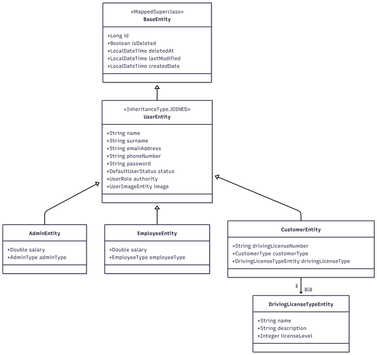
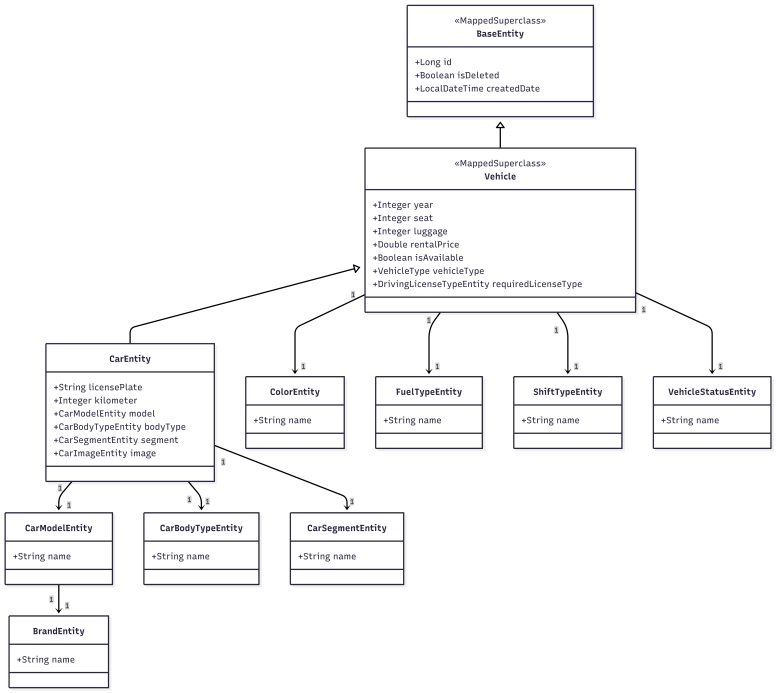
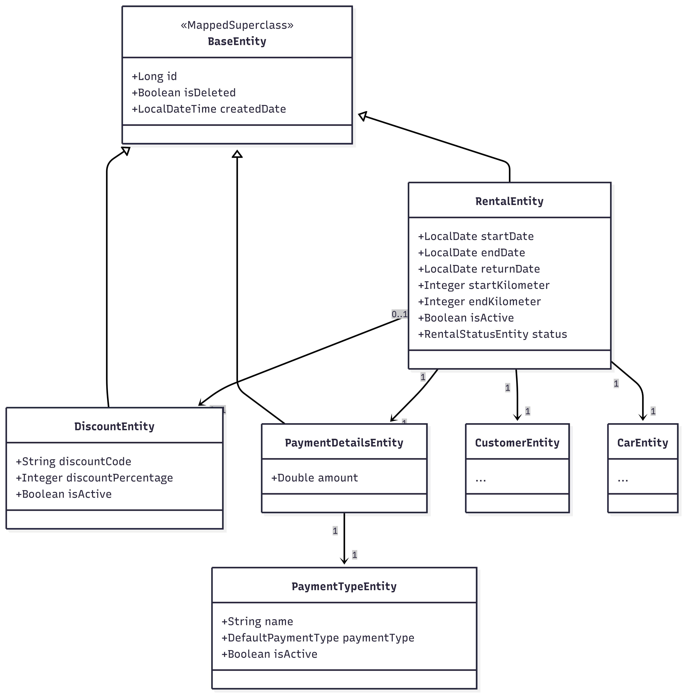

<div align="center">


**Università degli Studi di Salerno**

Corso di Laurea in Sicurezza Informatica per Tecnologie Cloud

<br>

# ExtendRent

**Relazione di Progetto**

SW Engineering for Secure Cloud Systems · A.A. 2025/2026

<br>

[](https://github.com/aaselli2-unisa/rentACar_backend/actions/workflows/ci.yml)
[](https://github.com/aaselli2-unisa/rentACar_backend/actions/workflows/deploy.yml)

<br>

| Studente | Matricola |
|---|---|
| Andrea Aselli | NF22700005 |
| Benedetto Pio Turino | NF22700010 |
| Emanuele Pascale | NF22700002 |

</div>

---

## Indice

1. [Descrizione dell'Applicazione, Stack Tecnologico e System Design](#1-descrizione-dellapplicazione-stack-tecnologico-e-system-design)
   - [1.1 Descrizione dell'Applicazione](#11-descrizione-dellapplicazione)
   - [1.2 Stack Tecnologico](#12-stack-tecnologico)
   - [1.3 System Design - Class Diagram](#13-system-design--class-diagram)
2. [Architettura e Ruoli](#2-architettura-e-ruoli)
   - [2.1 Architettura](#21-architettura)
   - [2.2 Ruoli](#22-ruoli)
   - [2.3 Matrice di Accesso RBAC](#23-matrice-di-accesso-rbac)
3. [Frontend](#3-frontend)
   - [3.1 Stack Tecnologico](#31-stack-tecnologico)
   - [3.2 Architettura e Struttura](#32-architettura-e-struttura)
   - [3.3 Autenticazione e Sicurezza](#33-autenticazione-e-sicurezza)
   - [3.4 Configurazione nginx](#34-configurazione-nginx)
4. [API Reference](#4-api-reference)
5. [Vulnerabilità e Test di Sicurezza](#5-vulnerabilità-e-test-di-sicurezza)
   - [5.1 Broken Access Control - A01](#51-broken-access-control--a01)
   - [5.2 JWT & Token Management - A07](#52-jwt--token-management--a07)
   - [5.3 Authentication & Rate Limiting - A07](#53-authentication--rate-limiting--a07)
   - [5.4 Security Misconfiguration - A05](#54-security-misconfiguration--a05)
   - [5.5 Input Validation & Injection - A03](#55-input-validation--injection--a03)
   - [5.6 Cryptographic Failures - A02](#56-cryptographic-failures--a02)
   - [5.7 Logging & Monitoring - A09](#57-logging--monitoring--a09)
   - [5.8 SAST Automatico - SonarCloud](#58-sast-automatico--sonarcloud)
   - [5.9 Vulnerabilità Frontend](#59-vulnerabilità-frontend)
6. [Conformità OWASP Top 10 2025](#6-conformità-owasp-top-10-2025)
7. [Containerizzazione](#7-containerizzazione)
   - [7.1 Dockerfile Backend](#71-dockerfile-backend-dockerfile)
   - [7.2 Dockerfile Frontend](#72-dockerfile-frontend-dockerfile)
   - [7.3 Docker Compose](#73-docker-compose-docker-composeyml)
8. [Strumenti di Sicurezza Automatici](#8-strumenti-di-sicurezza-automatici)
   - [8.1 GitGuardian](#81-gitguardian--secret-detection)
   - [8.2 Snyk](#82-snyk--software-composition-analysis-sca)
   - [8.3 Semgrep](#83-semgrep--sast-pattern-based)
   - [8.4 SonarCloud](#84-sonarcloud--sast--quality-gate--coverage)
   - [8.5 Trivy](#85-trivy--container-security-scanning)
9. [Pipeline CI/CD](#9-pipeline-cicd)
   - [9.1 Workflow CI](#91-workflow-ci-githubworkflowsciyml)
   - [9.2 Workflow Deploy](#92-workflow-deploy-githubworkflowsdeployyml)
   - [9.3 Workflow Deploy Frontend](#93-workflow-deploy-frontend-githubworkflowsdeployyml)
   - [9.4 Sicurezza della Pipeline](#94-sicurezza-della-pipeline)
   - [9.5 Segreti Pipeline](#95-segreti-pipeline)
10. [Kubernetes](#10-kubernetes)
    - [10.1 Architettura](#101-architettura)
    - [10.2 Setup microk8s](#102-setup-microk8s)
    - [10.3 Secrets](#103-secrets)
    - [10.4 Build e Push Immagini](#104-build-e-push-immagini)
    - [10.5 Manifest Kubernetes](#105-manifest-kubernetes)
    - [10.6 Aggiornamenti](#106-aggiornamenti)

---

## 1. Descrizione dell'Applicazione, Stack Tecnologico e System Design

### 1.1 Descrizione dell'Applicazione

**ExtendRent** è un sistema REST API per la gestione del noleggio di autoveicoli. La piattaforma copre l'intero ciclo di vita del noleggio, dalla registrazione del cliente alla restituzione del mezzo, con autenticazione JWT, tre ruoli applicativi e integrazione con Cloudinary (immagini) e SMTP (email OTP). Tutte le entità adottano *soft delete*: i dati non vengono mai cancellati fisicamente.

Funzionalità principali:

- **Autenticazione JWT**: Registrazione, login, refresh token, verifica account via OTP. Il token JWT è veicolato come cookie `HttpOnly; Secure; SameSite=Strict` (non in `localStorage`) in modo che JavaScript non possa leggerlo anche in caso di XSS (patch V-02)
- **RBAC a tre ruoli**: Admin, Employee, Customer con policy deny-by-default
- **Catalogo Veicoli**: Ricerca filtrata su 23 attributi (marca, colore, carburante, segmento, tipo patente)
- **Ciclo di Vita del Noleggio**: Creazione, avvio, restituzione, cancellazione con tracciamento chilometri
- **Pagamenti e Sconti**: Report ricavi, codici sconto con percentuale configurabile
- **Upload Immagini**: Su Cloudinary con whitelist del tipo file (patch V07)
- **API Documentation**: Swagger UI all'indirizzo `/swagger-ui/index.html`. Prima della patch V13 era accessibile a chiunque fosse loggato; dopo la patch richiede il ruolo ADMIN. Un Customer o un Employee che tenta di aprire quella pagina riceve 403.

All'avvio, `SeedDataConfig` popola automaticamente le tabelle di lookup: marche, modelli, colori, tipi carburante, cambi, carrozzerie, segmenti, stati veicolo, stati noleggio, tipi di pagamento, tipi di patente e utente admin di default.


### 1.2 Stack Tecnologico

| Tecnologia | Versione | Scopo |
|---|---|---|
| **Java** | 17 | Linguaggio principale |
| **Spring Boot** | 3.5.14 | Framework REST API (aggiornato da 3.5.13 a 3.5.14 per CVE Snyk) |
| **Spring Security** | 6.5.10 | Autenticazione JWT, RBAC, filter chain |
| **Spring Data JPA + Hibernate** | 3.5.11 / 6.6.49 | ORM e accesso database |
| **Spring Validation** | 3.5.14 | Bean validation Jakarta |
| **Spring Mail** | 3.5.14 | Invio email OTP e notifiche |
| **Spring Actuator** | 3.5.14 | `/actuator/health` per health check Docker |
| **PostgreSQL driver** | 42.7.11 | Connettività database (pinned per CVE fix) |
| **JWT (jjwt)** | 0.11.2 | Generazione e validazione token HS256 |
| **Bucket4j** | 8.0.1 | Rate limiting con algoritmo token-bucket (ogni IP dispone di un "secchio" di token che si ricarica a velocità fissa; ogni richiesta consuma un token; quando il secchio è vuoto si risponde 429) |
| **Caffeine** | 3.13.0 | Cache bounded per bucket per-IP (eviction 2 min, max 50k entry) |
| **Cloudinary SDK** | 1.27.0 | Storage immagini |
| **commons-text** | 1.10.0 | Escape/sanitize stringhe |
| **Lombok** | 1.18.30 | Riduzione boilerplate |
| **Swagger / OpenAPI** | 2.0.4 | Documentazione API (springdoc) |
| **progressbar** | 0.10.0 | Progress bar ASCII durante seed dati all'avvio |


**Dipendenze di test:**

| Artifact | Scopo |
|----------|-------|
| `spring-boot-starter-test` | JUnit 5, Mockito, Spring Test, MockMvc |
| `spring-security-test` | `SecurityMockMvcRequestPostProcessors` - test con ruoli simulati |
| `h2` | Database in-memory per i web-layer test - nessun PostgreSQL richiesto in CI |
| `assertj-core` | Asserzioni fluent nei test di sicurezza |
| `mockito-core` | Mock degli oggetti nei test unitari |

### 1.3 System Design - Class Diagram

Tutti gli oggetti persistenti ereditano da `BaseEntity`, una *MappedSuperclass* che fornisce i campi comuni a tutte le entità: `id`, `isDeleted`, `deletedAt`, `lastModified` e `createdDate`, garantendo uniformità e supportando il meccanismo di *soft delete* adottato dall'intera applicazione.

#### Gerarchia degli Utenti

`UserEntity` è la classe base per tutti gli utenti del sistema e utilizza la strategia di ereditarietà di JPA di tipo *JOINED*: ogni ruolo ha una propria tabella che estende quella comune. I campi condivisi includono nome, cognome, indirizzo email, numero di telefono, password, stato account (`DefaultUserStatus`) e ruolo (`UserRole`).

Le tre sottoclassi modellano i ruoli nell'applicazione:
- **`AdminEntity`** - amministratore del sistema; aggiunge `salary` e `adminType` per distinguere super-admin da admin ordinari.
- **`EmployeeEntity`** - dipendente operativo; aggiunge `salary` e `employeeType`.
- **`CustomerEntity`** - cliente finale; aggiunge `drivingLicenseNumber`, `customerType` e un riferimento a `DrivingLicenseTypeEntity`, che modella il tipo di patente posseduta e ne codifica il livello (`licenseLevel`) per verificare la compatibilità con i veicoli noleggiabili.



#### Gerarchia dei Veicoli

`Vehicle` è una *MappedSuperclass* astratta che raggruppa le caratteristiche generali di qualsiasi mezzo noleggiabile: anno di immatricolazione, numero di posti, capacità bagagli, prezzo giornaliero e flag `isAvailable`. Contiene riferimenti alle entità di classificazione (`ColorEntity`, `FuelTypeEntity`, `ShiftTypeEntity`, `VehicleStatusEntity`) e al tipo di patente richiesta (`requiredLicenseType`), confrontato con quello del cliente in fase di prenotazione.

La classe concreta **`CarEntity`** estende `Vehicle` aggiungendo gli attributi specifici dell'automobile: targa (`licensePlate`), chilometraggio (`kilometer`), tipo di carrozzeria (`CarBodyTypeEntity`), segmento di mercato (`CarSegmentEntity`) e modello (`CarModelEntity`). Quest'ultimo è a sua volta collegato a `BrandEntity`, che rappresenta il costruttore del veicolo (es. Audi, BMW, Toyota) e ne conserva l'immagine su Cloudinary.



#### Dominio del Noleggio e dei Pagamenti

`RentalEntity` è il fulcro del sistema e rappresenta un contratto di noleggio nella sua interezza. Aggrega un riferimento al cliente (`CustomerEntity`) e al veicolo noleggiato (`CarEntity`), le date di inizio, fine e restituzione effettiva, i chilometri di partenza e arrivo per il calcolo del percorso, lo stato corrente del noleggio (`RentalStatusEntity`) e il flag `isActive` che indica se il noleggio è in corso.

Il pagamento è modellato da **`PaymentDetailsEntity`** (uno-a-uno per noleggio): registra l'importo totale e il tipo di pagamento tramite `PaymentTypeEntity` (es. carta di credito, contanti, bonifico), anch'essa configurabile con stato attivo/inattivo. Opzionalmente, `RentalEntity` può essere collegata a una **`DiscountEntity`** con codice sconto a percentuale configurabile e stato attivo/inattivo, permettendo al sistema di calcolare automaticamente l'importo scontato al momento della creazione del noleggio.



---

## 2. Architettura e Ruoli

### 2.1 Architettura

Il diagramma mostra il percorso di una richiesta dall'esterno fino al database.

```
           Browser / Client
                │ :80 (unico punto di ingresso pubblico)
                ▼
           nginx:80 (Frontend SPA)
          ┌──────┴─────────────────────────────────┐
          │ / → asset React statici                 │ /api/ → reverse proxy
                                      Spring Boot :8080 (non esposto all'host)
                                      ├─ RateLimitFilter  ← Bucket4j, 10 req/min per IP
                                      ├─ JwtAuthFilter    ← legge cookie HttpOnly
                                      ├─ Controller Layer
                                      ├─ Service Layer
                                      └─ Repository Layer (23 repository JPA)
                                                   │
                                         PostgreSQL :5432 (non esposto all'host)
                                      Servizi esterni:
                                      ├─ Cloudinary  (immagini)
                                      └─ SMTP Gmail  (email OTP)
```

nginx è l'unico punto esposto all'host. Backend e database comunicano sulla rete Docker `rentacar-net` e non sono mai raggiungibili dall'esterno, il che elimina problemi con CORS (stessa origine) e nasconde la topologia interna. All'interno di Spring Boot ogni richiesta attraversa prima la filter chain (rate limiting per IP, poi validazione del JWT), poi Controller, Service e Repository layer fino a PostgreSQL.

**Componenti di sicurezza (`core/`):**

| Componente | File | Cosa fa |
|------------|------|---------|
| JWT Filter | `JwtAuthFilter.java` | Su ogni richiesta estrae il token dal cookie, ne verifica firma e scadenza e imposta l'identità dell'utente per il resto della catena |
| Rate Limiter | `RateLimitFilter.java` | Conta le richieste per IP e blocca con HTTP 429 chi supera 10 req/min su `/api/**` |
| Security Config | `SecurityConfig.java` | Definisce quali endpoint sono pubblici e quali richiedono autenticazione o ruolo specifico |

### 2.2 Ruoli

| Ruolo | Descrizione |
|-------|-------------|
| **Admin** | Gestione completa: utenti, veicoli, noleggi, sconti, pagamenti, report, immagini |
| **Employee** | Gestione operativa: avanzamento stato noleggi (via business logic) |
| **Customer** | Ricerca veicoli, prenotazione e gestione dei propri noleggi |

Employee e Customer non si distinguono a livello Spring Security: entrambi sono `authenticated()`. La distinzione tra i due è gestita nel service layer.

### 2.3 Matrice di Accesso RBAC

Regole definite in [`SecurityConfig.java`](https://github.com/aaselli2-unisa/rentACar_backend/blob/master/src/main/java/src/core/config/SecurityConfig.java):

- **Anonimo Sì**: endpoint pubblico, nessuna autenticazione richiesta. Esempio: `/auth/signup`.
- **Autenticato Sì**: richiede token JWT valido, qualunque sia il ruolo. Esempio: `POST /auth/logout`; Customer, Employee e Admin possono fare logout.
- **ADMIN Sì**: richiede il ruolo `ROLE_ADMIN`; Customer e Employee ricevono 403. Esempio: `/api/v1/admins/**`.
- **Cella vuota in ADMIN** (riga con Autenticato = Sì): Admin può accedere ugualmente perché è un utente autenticato
- **Cella vuota in Autenticato** (riga con ADMIN = Sì): l'endpoint è riservato ad Admin; un Customer autenticato riceve 403.

| Endpoint / Risorsa | Anonimo | Autenticato | ADMIN |
|--------------------|:-------:|:-----------:|:-----:|
| `POST /api/v1/auth/signup` | Sì | | Sì |
| `POST /api/v1/auth/signin` | Sì | | Sì |
| `POST /api/v1/auth/isUserTrue` | Sì | | Sì |
| `GET /api/v1/verify/**` | Sì | | Sì |
| `POST /api/v1/refresh-token/**` | Sì | | Sì |
| `GET /api/v1/drivingLicenseType/**` | Sì | | Sì |
| `GET /actuator/health` | Sì | | Sì |
| `POST /api/v1/auth/logout` | No | Sì | |
| `GET /api/v1/cars/**`, `/brands/**`, `/colors/**`, `/fuels/**`, `/gearshifts/**`, `/vehicle-statuses/**`, `/carBodyTypes/**`, `/carModels/**`, `/car-segments/**` | No | Sì | |
| `GET /api/v1/rentalStatuses/**` | No | Sì | |
| `POST/PUT/DELETE /api/v1/cars/**` (e tutti i catalogo) | No | | Sì |
| `POST/PUT/DELETE /api/v1/drivingLicenseType/**` | No | | Sì |
| `/api/v1/admins/**` | No | | Sì |
| `/api/v1/users/**` | No | | Sì |
| `/api/v1/employees/**` | No | | Sì |
| `/api/v1/rentals/**` | No | | Sì |
| `/api/v1/customers/**` | No | | Sì |
| `/api/v1/discounts/**` | No | | Sì |
| `/api/v1/paymentDetails/**` | No | | Sì |
| `/api/v1/paymentTypes/**` | No | | Sì |
| `/api/v1/images/**` | No | | Sì |
| `GET /swagger-ui/**`, `/v3/api-docs/**` | No | | Sì |
| Qualsiasi altra richiesta (`.anyRequest()`) | No | Sì | |

---

## 3. Frontend

Il frontend di **ExtendRent** è una Single Page Application (SPA) sviluppata con **React 18** e **TypeScript**, che si interfaccia con il backend Spring Boot tramite API REST. L'applicazione è containerizzata con Docker e servita da nginx.

### 3.1 Stack Tecnologico

| Categoria | Tecnologia | Versione |
|-----------|-----------|----------|
| **Framework UI** | React + TypeScript | 18.0.2 / 4.9.5 |
| **Routing** | React Router DOM | 6.21.1 |
| **State management** | Redux Toolkit | 2.0.1 |
| **HTTP client** | Axios (con interceptors) | 1.6.5 |
| **Form handling** | Formik + Yup | 2.4.5 / 1.3.3 |
| **UI libraries** | Material UI, Mantine, Bootstrap | 5.15 / 7.4 / 5.3 |
| **Tabelle** | material-react-table | 2.11.2 |
| **Date picker** | @mantine/dates, @mui/x-date-pickers | 7.4 / 6.19 |
| **Animazioni** | Framer Motion | 10.17 |
| **Token decoding** | jwt-decode | 4.0.0 |
| **Build** | Create React App + React Scripts | 5.0.1 |
| **Server** | nginx | 1.27-alpine |

### 3.2 Architettura e Struttura

Il progetto segue un'architettura a strati:

- **`pages/`** - 30+ pagine React suddivise per dominio funzionale. Includono pagine pubbliche (Homepage, Login, SignUp), pagine per utenti autenticati (Account, PastRentals) e pagine di amministrazione protette (`adminPanel/**`).
- **`components/`** - Componenti riutilizzabili: `Navbar`, `Search`, `Payment`, `CarCart`, `RentalDetail`, `OverlayLoader` (loading globale), `CreditCardForm`, `PasswordStrength`.
- **`store/`** - Memoria condivisa dell'applicazione, gestita con Redux che gestisce lo stato in maniera centralizzata per i componenti.
- **`services/`** - 20+ classi che raccolgono le chiamate al backend per ogni entità (auto, noleggi, clienti, marche, colori, ecc.). Ogni componente che ha bisogno di dati chiama il service corrispondente invece di costruire le richieste HTTP da solo.
- **`models/`** - Definizioni TypeScript dei dati scambiati con il backend. Servono al compilatore per segnalare errori se si usa un campo sbagliato.
- **`utils/`** - `axiosInterceptors.ts` configura l'istanza Axios con `withCredentials: true` (il browser allega i cookie su ogni richiesta). `useToken.ts` legge e decodifica il JWT dal cookie per esporre ID, ruolo ed email all'interfaccia.

```
rent-a-car-frontend-project/src/
|-- App.tsx               # Routing principale (React Router v6)
|-- index.tsx             # Entry point con Provider Redux
|-- pages/                # 30+ pagine per dominio
|   |-- Homepage/         # Pubblica: search + video background
|   |-- Login/ SignUp/    # Autenticazione
|   |-- AdminPanel/       # Dashboard admin (protetta)
|   |-- Cars/ Rental/     # CRUD auto e noleggi
|   |-- Customer/         # Gestione clienti
|   |-- PastRentals/      # Storico noleggi cliente
|   `-- [Brands, Colors, FuelType, Discount, Payment, ...]
|-- components/           # Componenti riutilizzabili
|-- store/                # Redux Toolkit (22 slice)
|-- services/             # Axios service classes (20+)
|-- models/               # TypeScript models (request/response)
|-- utils/                # axiosInterceptors, useToken
`-- data/config.json      # Base URL API
```

### 3.3 Autenticazione e Sicurezza

Il frontend implementa un meccanismo di autenticazione allineato con le patch di sicurezza applicate al backend.

**HttpOnly Cookie**

Un cookie `HttpOnly` è un cookie che il codice JavaScript della pagina non può leggere: solo il browser lo gestisce, inviandolo automaticamente al server su ogni richiesta verso lo stesso dominio. Questo protegge il token di autenticazione dagli attacchi XSS (se uno script malevolo venisse iniettato nella pagina, non potrebbe rubare il token perché non lo vede).

Prima della patch V02, il token JWT era salvato in `localStorage`, una zona di memoria a cui qualsiasi script in pagina ha accesso libero. Dopo la patch, il backend imposta il token come cookie `HttpOnly; Secure; SameSite=Strict` e il frontend smette di usare `localStorage`.

```ts
const axiosInstance = axios.create({
  baseURL: config.apiBaseUrl,
  withCredentials: true,  // dice al browser di allegare i cookie su ogni richiesta API
});
```

 Il backend non include più il token JWT nel corpo della risposta al login (il campo `token` è vuoto); il token viaggia solo via cookie. Il frontend ha però bisogno di sapere chi è l'utente loggato (ID, ruolo, email) per decidere cosa mostrare nell'interfaccia. Per questo, `useToken.ts` legge e decodifica il JWT direttamente dal cookie senza mai esporlo.

**Validazione Form**

Tutti i form usano **Formik** con schemi **Yup** (libreria JavaScript di validazione basata su schema: si definisce la forma attesa dei dati e Yup verifica ogni campo prima dell'invio) per la validazione client-side:
- Password: lunghezza, complessità, visualizzata con `PasswordStrength`.
- Targa veicolo: regex formato.
- Email: schema Yup `.email()`.
- Date noleggio: vincoli temporali (data fine dopo data inizio).
- Dati carta di credito: validazione numero e CVV.

### 3.4 Configurazione nginx

Il frontend è una **Single Page Application** React. Al build-time, Create React App compila tutto il codice TypeScript/JSX in bundle statici (HTML, CSS, JS). In produzione, nginx serve i bundle e fa da reverse proxy verso il backend:

```
Browser
  │
  ├── GET /dashboard    → nginx serve index.html → React Router gestisce la route
  └── POST /api/v1/...  → nginx proxy_pass → Spring Boot :8080 (rete Docker interna)
                                              (il browser non vede mai la porta 8080)
```

---

## 4. API Reference

La documentazione completa degli endpoint è disponibile tramite **Swagger UI** all'indirizzo `/swagger-ui/index.html`.

**Come accedere.** Swagger non è accessibile a chiunque: nel fork originale era aperto a qualsiasi utente autenticato, il che permetteva a un Customer di esplorare tutte le route Admin e capire la struttura dell'API. Abbiamo ristretto l'accesso al solo ruolo ADMIN aggiungendo in `SecurityConfig.java` la regola:

```java
.requestMatchers("/swagger-ui/**", "/v3/api-docs/**").hasRole("ADMIN")
```

Con questa configurazione, un utente non autenticato riceve 401 e un Customer o Employee riceve 403. Solo un Admin può aprire la documentazione. In produzione (profilo Spring `prod`) Swagger è completamente disabilitato: gli endpoint `/swagger-ui/**` e `/v3/api-docs/**` restituiscono 404, così la documentazione non è mai esposta in un ambiente pubblico.

Per esplorare gli endpoint in locale o in sviluppo: effettuare il login con un account Admin, poi aprire `/swagger-ui/index.html`. Il cookie di sessione viene inviato automaticamente dal browser e Swagger UI risulta accessibile.

---

## 5. Vulnerabilità e Test di Sicurezza

Seguendo le categorie OWASP Top 10 2025 come guida, abbiamo individuato le aree di rischio e scritto test per ciascuna categoria: I test **falliscono sul fork** (la vulnerabilità esiste nel codice originale) e **passano dopo la patch** (la correzione funziona). Ogni voce ha questa struttura:
1. **Vulnerabilità trovata**: il problema emerso dal fallimento del test
2. **Test**: cosa simula e cosa verifica
3. **Patch**: la correzione applicata per far passare il test


**28 vulnerabilità identificate: 25 backend, 3 frontend, tutte risolte.**

Le **43 classi** nel package `com.extendrent.security` non corrispondono 1:1 alle 28 vulnerabilità: alcune coprono una singola vulnerabilità numerata, altre verificano la corretta configurazione del controllo degli accessi su tutti i controller (test di regressione senza un finding specifico). La suite usa H2 (un DB in-memory), non effettua chiamate a Cloudinary o SMTP, e il rate limiting è disabilitabile via `app.rate-limit.enabled=false` nel profilo `test`. Totale: **394 test di sicurezza**: 349 `@Test` e 11 `@ParameterizedTest` che generano altre 45 istanze.

> **Nota:** i nomi delle classi di test nelle sezioni seguenti sono **link cliccabili** al codice sorgente su GitHub.

| Area | OWASP | Classi | Vulnerabilità identificate e coperte |
|------|:-----:|:------:|----------------------|
| Broken Access Control (RBAC) | A01 | 15 | S1-1, V02, endpoint controller completi |
| JWT & Token Management | A07 | 5 | V05, V09, V10, V-02, V-04, V-05 |
| Authentication & Rate Limiting | A07 | 4 | V06, V11, V-03, V-08, V-14 |
| Security Misconfiguration | A05 | 6 | V03, V12, V13, V14, V-06, V-13 |
| Input Validation & Injection | A03 | 3 | V07, V-10, V-11, SQL injection, XSS |
| Cryptographic Failures | A02 | 1 | V04 |
| Logging & Monitoring | A09 | 2 | V05, V08 |
| **TOTALE test di sicurezza** | - | **43** + [`SecurityTestSupport`](https://github.com/aaselli2-unisa/rentACar_backend/blob/master/src/test/java/com/extendrent/security/SecurityTestSupport.java) | **394/394** |

```bash
# Suite completa (test di sicurezza e non)
mvn test

# Solo test di sicurezza (profilo Maven dedicato)
mvn test -P security-tests

# Alternativa con filtro package
mvn test -Dtest="com/extendrent/security/**"
```

---

### 5.1 Broken Access Control - A01

Il fork originale configurava la filter chain di Spring Security con `anyRequest().permitAll()` come regola finale, rendendo ogni endpoint pubblico senza autenticazione. Endpoint admin e di gestione utenti erano accessibili senza credenziali. Un secondo problema riguardava la registrazione: accettava `authority=ADMIN` nel body della richiesta, lasciando al client la scelta del proprio ruolo. Il rischio era duplice: escalation verticale (accesso a ruoli non propri) e IDOR (Insecure Direct Object Reference, cioè la possibilità di modificare un ID nella richiesta per accedere a risorse di altri utenti). Abbiamo riscritto `SecurityConfig` con policy deny-by-default; ogni controller ha una classe di test dedicata che invia richieste HTTP simulate via MockMvc con token di ruoli diversi e verifica il codice di risposta.

[**`SecurityFilterChainTest`**](https://github.com/aaselli2-unisa/rentACar_backend/blob/master/src/test/java/com/extendrent/security/SecurityFilterChainTest.java)

> Tutti gli endpoint del sistema

**Vulnerabilità:** il fork originale terminava con `anyRequest().permitAll()`: ogni endpoint era raggiungibile senza autenticazione.

**Test:** invia richieste con token Admin, Employee, Customer e senza token su ogni endpoint del sistema. Per gli endpoint pubblici (`/auth/**`, `/actuator/health`) verifica 200 o 404; per tutti gli altri verifica 401 senza token e 403 con ruolo insufficiente.

**Patch:** [`SecurityConfig`](https://github.com/aaselli2-unisa/rentACar_backend/blob/master/src/main/java/src/core/config/SecurityConfig.java) riscritto con `anyRequest().denyAll()` e regole esplicite per ogni endpoint.

---

[**`RoleEscalationSecurityTest`**](https://github.com/aaselli2-unisa/rentACar_backend/blob/master/src/test/java/com/extendrent/security/RoleEscalationSecurityTest.java)

> `POST /auth/register`

**Vulnerabilità:** `POST /auth/register` accettava il campo `authority` dal body senza validarlo. Bastava inviare `"authority": "ADMIN"` per registrarsi come amministratore modificando il payload con curl o DevTools.

**Test:** invia una richiesta di registrazione con `"authority": "ADMIN"` nel body e verifica che la risposta sia 403. Sul fork originale il test falliva: l'utente veniva registrato come ADMIN.

| Scenario | Comportamento |
|----------|--------------|
| CUSTOMER con `authority=ADMIN` in payload | 403 - escalation bloccata |

**Patch:** `@AssertTrue isAuthorityCustomer()` in [`SignUpRequest`](https://github.com/aaselli2-unisa/rentACar_backend/blob/master/src/main/java/src/controller/auth/authentication/request/SignUpReqeust.java) rifiuta qualsiasi valore diverso da `CUSTOMER` prima che la logica di business venga eseguita. Il ruolo è determinato esclusivamente lato server.

---

[**`AdminControllerSecurityTest`**](https://github.com/aaselli2-unisa/rentACar_backend/blob/master/src/test/java/com/extendrent/security/AdminControllerSecurityTest.java) · [**`EmployeeControllerSecurityTest`**](https://github.com/aaselli2-unisa/rentACar_backend/blob/master/src/test/java/com/extendrent/security/EmployeeControllerSecurityTest.java)

> Endpoint amministrativi e dipendenti

**Vulnerabilità:** con `anyRequest().permitAll()` nel fork originale, gli endpoint `/api/v1/admins/**` e `/api/v1/employees/**` erano accessibili a chiunque senza token.

**Test:** chiama ogni metodo HTTP di questi endpoint con token Admin, Employee, Customer e senza token. Verifica che solo Admin riceva 2xx, gli altri 403 o 401.

| Unauthenticated | Customer | Employee | Admin |
|:-:|:-:|:-:|:-:|
| 401 | 403 | 403 | 2xx |

**Patch:** regole `.hasRole("ADMIN")` esplicite in [`SecurityConfig`](https://github.com/aaselli2-unisa/rentACar_backend/blob/master/src/main/java/src/core/config/SecurityConfig.java) per questi path.

---

[**`RentalControllerSecurityTest`**](https://github.com/aaselli2-unisa/rentACar_backend/blob/master/src/test/java/com/extendrent/security/RentalControllerSecurityTest.java) · [**`CarControllerSecurityTest`**](https://github.com/aaselli2-unisa/rentACar_backend/blob/master/src/test/java/com/extendrent/security/CarControllerSecurityTest.java)

> Endpoint noleggi e catalogo veicoli

**Vulnerabilità:** con `permitAll()` nel fork, noleggi e catalogo veicoli erano accessibili senza autenticazione; Customer ed Employee potevano leggere e modificare dati riservati ad Admin.

**Test:** invia GET, POST, PUT, DELETE a `/api/v1/rentals/**` e `/api/v1/cars/**` con token Customer, Employee e senza token. Verifica 401 senza token e 403 con ruolo non sufficiente.

| Unauthenticated | Customer | Employee | Admin |
|:-:|:-:|:-:|:-:|
| 401 | 403 | 403 | 2xx |

**Patch:** `.hasRole("ADMIN")` su questi path in [`SecurityConfig`](https://github.com/aaselli2-unisa/rentACar_backend/blob/master/src/main/java/src/core/config/SecurityConfig.java).

---

[**`CustomerControllerSecurityTest`**](https://github.com/aaselli2-unisa/rentACar_backend/blob/master/src/test/java/com/extendrent/security/CustomerControllerSecurityTest.java) · [**`UserControllerSecurityTest`**](https://github.com/aaselli2-unisa/rentACar_backend/blob/master/src/test/java/com/extendrent/security/UserControllerSecurityTest.java)

> Accesso ai profili e modifica password

**Vulnerabilità:** nel fork non esisteva protezione IDOR su `PUT /api/v1/user/{id}/password`: un Customer poteva modificare la password di qualsiasi altro utente cambiando `{id}` nella richiesta. Analogamente, non c'era restrizione sulla lettura di profili altrui.

**Test:** `UserControllerSecurityTest` invia richieste con un ID diverso da quello nel JWT e verifica 403. `CustomerControllerSecurityTest` verifica che la lettura di profili altrui restituisca 403.

| Scenario | Comportamento |
|----------|--------------|
| Utente aggiorna propria password | Sì |
| Utente aggiorna password di altro utente (IDOR) | 403 |
| Customer legge profilo altrui | 403 |

**Patch:** confronto esplicito tra l'ID nel path parameter e l'ID estratto dal JWT nel `SecurityContext`; se non coincidono la richiesta viene rifiutata prima di raggiungere il servizio.

---

[**`DiscountControllerSecurityTest`**](https://github.com/aaselli2-unisa/rentACar_backend/blob/master/src/test/java/com/extendrent/security/DiscountControllerSecurityTest.java) · [**`ImageControllerSecurityTest`**](https://github.com/aaselli2-unisa/rentACar_backend/blob/master/src/test/java/com/extendrent/security/ImageControllerSecurityTest.java) · [**`PaymentDetailControllerSecurityTest`**](https://github.com/aaselli2-unisa/rentACar_backend/blob/master/src/test/java/com/extendrent/security/PaymentDetailControllerSecurityTest.java) · [**`PaymentTypeControllerSecurityTest`**](https://github.com/aaselli2-unisa/rentACar_backend/blob/master/src/test/java/com/extendrent/security/PaymentTypeControllerSecurityTest.java)

> Endpoint sconti, immagini, dettagli pagamento, tipi pagamento

Test di regressione sulla configurazione di accesso: nessuna vulnerabilità numerata specifica, ma senza questa copertura una modifica accidentale a [`SecurityConfig`](https://github.com/aaselli2-unisa/rentACar_backend/blob/master/src/main/java/src/core/config/SecurityConfig.java) potrebbe esporre questi endpoint senza che la CI se ne accorga.

**Test:** ogni endpoint viene chiamato senza token (401 atteso), con token Customer/Employee (403 per le operazioni di scrittura) e con token Admin (2xx). `ImageControllerSecurityTest` verifica anche che il POST di upload richieda autenticazione.

| Unauthenticated | Customer/Employee | Admin |
|:-:|:-:|:-:|
| 401 | 403 (write) | 2xx |

**Patch:** regole esplicite aggiunte in [`SecurityConfig`](https://github.com/aaselli2-unisa/rentACar_backend/blob/master/src/main/java/src/core/config/SecurityConfig.java) per tutti questi path; test come regressione permanente.

---

[**`LookupControllerSecurityTest`**](https://github.com/aaselli2-unisa/rentACar_backend/blob/master/src/test/java/com/extendrent/security/LookupControllerSecurityTest.java) · [**`DrivingLicenseTypeControllerSecurityTest`**](https://github.com/aaselli2-unisa/rentACar_backend/blob/master/src/test/java/com/extendrent/security/DrivingLicenseTypeControllerSecurityTest.java) · [**`VerifyControllerSecurityTest`**](https://github.com/aaselli2-unisa/rentACar_backend/blob/master/src/test/java/com/extendrent/security/VerifyControllerSecurityTest.java)

> Endpoint lookup, tipi di patente, verifica email

Test di regressione sulla configurazione di accesso: `DrivingLicenseTypeController` e `VerifyController` espongono endpoint pubblici intenzionali (`permitAll()`) necessari per il form di registrazione. Senza questi test, una modifica errata a [`SecurityConfig`](https://github.com/aaselli2-unisa/rentACar_backend/blob/master/src/main/java/src/core/config/SecurityConfig.java) che chiudesse questi endpoint romperebbe il signup senza che la CI se ne accorgesse.

**Test:** `LookupControllerSecurityTest` verifica che i lookup richiedano autenticazione. `DrivingLicenseTypeControllerSecurityTest` verifica che il GET sia pubblico E che POST/PUT/DELETE restino Admin-only. `VerifyControllerSecurityTest` verifica che `GET /api/v1/verify/email` resti pubblico.

**Patch:** test come regressione permanente sulla configurazione di sicurezza.

---

### 5.2 JWT & Token Management - A07

Il ciclo di vita dei token aveva diverse falle: access e refresh token condividevano lo stesso TTL di 24 ore; non esisteva un endpoint di logout né una revoca server-side, quindi un token rubato restava valido fino a scadenza; il payload JWT conteneva in chiaro nome, cognome e numero di telefono; il refresh token veniva stampato nei log con `log.info()`. I test coprono tutto il ciclo di vita: generazione, resistenza agli attacchi sulla firma, TTL separati, assenza di dati personali nel payload, revoca al logout e protezione del refresh token da furto e da logging accidentale.

[**`JwtServiceTest`**](https://github.com/aaselli2-unisa/rentACar_backend/blob/master/src/test/java/com/extendrent/security/JwtServiceTest.java)

**Vulnerabilità:** La generazione e validazione JWT era gestita da codice non testato; non c'era protezione esplicita contro attacchi sulla firma.

**Test:** testa `JwtService` in isolamento senza Spring context. Verifica generazione con HMAC-SHA256, parsing standard, e due attacchi noti: `alg:none` (imposta l'header JWT a `"none"` per bypassare la firma) e key confusion (usa la chiave pubblica come segreto HMAC).

| Scenario | Comportamento |
|----------|--------------|
| Generazione e validazione standard | Sì |
| Attacco `alg:none` | rifiutato |
| Key confusion attack | rifiutato |

**Patch:** [`JwtService`](https://github.com/aaselli2-unisa/rentACar_backend/blob/master/src/main/java/src/core/security/JwtService.java) usa JJWT con algoritmo fisso HMAC-SHA256; `alg:none` e algoritmi asimmetrici vengono rifiutati dalla libreria.

---

[**`JwtTtlSecurityTest`**](https://github.com/aaselli2-unisa/rentACar_backend/blob/master/src/test/java/com/extendrent/security/JwtTtlSecurityTest.java)

> Token access e refresh

**Vulnerabilità:** access token e refresh token condividevano lo stesso TTL di 24 ore; la distinzione era inutile e un token rubato restava valido per un giorno intero.

**Test:** verifica che un access token scaduto restituisca 401 e che i due TTL configurati (1h access, 7 giorni refresh) siano rispettati nella generazione.

| Scenario | Comportamento |
|----------|--------------|
| Access token scaduto | 401 |
| Refresh token scaduto | 401 |
| TTL access token (1h) | Sì |
| TTL refresh token (7 giorni) | Sì |

**Patch:** TTL separati configurati via property `refresh-expiration`; access token breve limita l'esposizione in caso di furto.

---

[**`JwtClaimsPIISecurityTest`**](https://github.com/aaselli2-unisa/rentACar_backend/blob/master/src/test/java/com/extendrent/security/JwtClaimsPIISecurityTest.java)

> Payload JWT

**Vulnerabilità:** il payload JWT conteneva in chiaro `firstname`, `lastname` e `phoneNumber`. Questi claim erano stati probabilmente aggiunti per evitare query extra al DB, ma il JWT può essere intercettato o loggato; i dati personali non devono essere leggibili fuori dal database.

**Test:** decodifica il JWT emesso al login e verifica che i claim PII siano assenti.

| Claim | Status |
|-------|--------|
| `sub` (user ID) | presente |
| `firstname`, `lastname`, `phoneNumber` | rimossi |

**Patch:** eliminati i claim dal payload; il backend ottiene i dati utente dal DB a partire dal `sub` quando necessario.

---

[**`JwtAuthFilterTest`**](https://github.com/aaselli2-unisa/rentACar_backend/blob/master/src/test/java/com/extendrent/security/JwtAuthFilterTest.java)

> Tutti gli endpoint protetti

**Vulnerabilità:** il filtro JWT non gestiva esplicitamente i casi di token assente, malformato o scaduto; potevano emergere eccezioni non catturate che esponevano stack trace.

**Test:** colpisce un endpoint protetto con token mancante, malformato e scaduto. Verifica che il filtro risponda sempre 401 senza eccezioni non gestite.

| Scenario | Comportamento |
|----------|--------------|
| Token mancante | 401 |
| Token malformato | 401 |
| Token scaduto | 401 |

**Patch:** `JwtAuthFilter` gestisce esplicitamente tutte e tre le condizioni restituendo 401 prima di propagare la richiesta ai controller.

---

[**`LogoutSecurityTest`**](https://github.com/aaselli2-unisa/rentACar_backend/blob/master/src/test/java/com/extendrent/security/LogoutSecurityTest.java)

> `POST /api/v1/auth/logout`

**Vulnerabilità:** non esisteva un endpoint di logout né revoca server-side; un token rubato restava valido fino alla scadenza naturale (24 ore).

**Test:** autentica un utente, usa il token su un endpoint protetto (200), chiama `/auth/logout`, poi ritenta la stessa richiesta con lo stesso token (401 atteso).

| Scenario | Comportamento |
|----------|--------------|
| Token valido prima del logout | accettato |
| Stesso token dopo logout | 401 - revocato |

**Patch:** logout revoca il token tramite `revokeAllForUser()` e invalida i cookie con `maxAge=0`.

---

[**`RefreshTokenRevocationSecurityTest`**](https://github.com/aaselli2-unisa/rentACar_backend/blob/master/src/test/java/com/extendrent/security/RefreshTokenRevocationSecurityTest.java)

> `POST /api/v1/auth/logout`

**Vulnerabilità:** il refresh token non veniva invalidato al logout; un attaccante che lo avesse rubato poteva continuare a ottenere nuovi access token anche dopo che la vittima si era disconnessa.

**Test:** effettua il logout e tenta di rinnovare l'access token con il refresh token appena invalidato. Verifica che la risposta sia 401.

**Patch:** al logout il refresh token viene invalidato nella tabella `refresh_tokens` (memorizzato come hash SHA-256). La rotazione obbligatoria fa sì che ogni token sia usabile una sola volta; un riuso rivela un possibile furto.

---

[**`RefreshTokenLoggingSecurityTest`**](https://github.com/aaselli2-unisa/rentACar_backend/blob/master/src/test/java/com/extendrent/security/RefreshTokenLoggingSecurityTest.java)

**Vulnerabilità:** `RefreshTokenController` stampava il refresh token con `log.info("...", refreshTokenRequest.getToken())`. Un token nei log equivale a un token esposto.

**Test:** cattura l'output dei log durante una chiamata di refresh e verifica che il valore del token non appaia in nessuna riga.

**Patch:** rimossa la riga di log; il token non compare mai nell'output di logging.

---

### 5.3 Authentication & Rate Limiting - A07

Gli endpoint di autenticazione erano completamente privi di protezione contro gli attacchi brute-force: nessun rate limiting, nessun lockout dopo tentativi falliti. La password veniva inoltre passata come query parameter (`GET /isUserTrue?password=...`), finendo in chiaro negli access log del server. ExtendRent implementa ora un token-bucket per IP (Bucket4j) con Caffeine, affiancato da un lockout esplicito dopo cinque tentativi falliti consecutivi.

[**`RateLimitingSecurityTest`**](https://github.com/aaselli2-unisa/rentACar_backend/blob/master/src/test/java/com/extendrent/security/RateLimitingSecurityTest.java) · [**`RateLimitingBehaviorTest`**](https://github.com/aaselli2-unisa/rentACar_backend/blob/master/src/test/java/com/extendrent/security/RateLimitingBehaviorTest.java)

> `POST /auth/**`

**Vulnerabilità:** nessun rate limiting sugli endpoint di autenticazione; un attaccante poteva tentare password illimitatamente senza conseguenze.

**Test:** `RateLimitingSecurityTest` simula un attacco inviando 10 richieste (accettate) poi la undicesima (429 atteso con `Retry-After: 60`). `RateLimitingBehaviorTest` verifica la logica del token-bucket in isolamento.

| Scenario | Comportamento |
|----------|--------------|
| Richieste entro soglia (≤10/min per IP) | 200 |
| Richieste oltre soglia | 429 + `Retry-After: 60` |

**Patch:** token-bucket per IP con Bucket4j; `ConcurrentHashMap` non bounded sostituito con Caffeine `expireAfterAccess(2min)` e `maximumSize(50_000)`.

---

[**`RateLimitXForwardedForSecurityTest`**](https://github.com/aaselli2-unisa/rentACar_backend/blob/master/src/test/java/com/extendrent/security/RateLimitXForwardedForSecurityTest.java)

> Header `X-Forwarded-For`

**Vulnerabilità:** il rate limiter leggeva sempre `X-Forwarded-For`; un client diretto poteva impostare quell'header con un IP arbitrario e aggirare il rate limiting fingendo di provenire da un altro indirizzo.

**Test:** invia richieste con `X-Forwarded-For` falso da IP non trusted e verifica che il rate limiter usi `getRemoteAddr()` invece dell'header.

| Scenario | Comportamento |
|----------|--------------|
| IP da proxy noto (loopback/RFC1918) | Letto da `X-Forwarded-For` |
| IP da fonte non trusted | Usato `getRemoteAddr()` diretto |

**Patch:** `X-Forwarded-For` viene letto solo se la richiesta proviene da IP di rete interna (loopback o RFC1918).

---

[**`AuthenticationControllerSecurityTest`**](https://github.com/aaselli2-unisa/rentACar_backend/blob/master/src/test/java/com/extendrent/security/AuthenticationControllerSecurityTest.java)

> `POST /auth/signin` · `POST /auth/register`

**Vulnerabilità:** l'endpoint originale accettava la password come query parameter (`GET /isUserTrue?password=...`); le password finivano in chiaro negli access log del server.

**Test:** verifica che la password in query string venga rifiutata, che signup rifiuti payload malformati (400), che signin risponda 401 a credenziali errate, e che path sconosciuti rispettino `anyRequest().denyAll()`.

| Scenario | Comportamento |
|----------|--------------|
| Password in query string | rifiutata |
| Signup con dati non validi | 400 |
| Signin con credenziali errate | 401 |
| Path sconosciuti (`anyRequest`) - 3 istanze | 401/403 |

**Patch:** endpoint GET rimosso; password accettata solo nel body JSON di POST.

---

[**`AccountLockoutSecurityTest`**](https://github.com/aaselli2-unisa/rentACar_backend/blob/master/src/test/java/com/extendrent/security/AccountLockoutSecurityTest.java)

> `POST /auth/signin`

**Vulnerabilità:** nessun meccanismo di lockout; un attaccante poteva tentare password illimitatamente senza mai essere bloccato.

**Test:** registra un utente, simula 5 tentativi di login errati, poi tenta il login con la password corretta (deve essere rifiutato). Verifica anche lo sblocco automatico dopo il TTL configurato.

| Scenario | Comportamento |
|----------|--------------|
| 5 tentativi falliti consecutivi | Account bloccato |
| Login con account bloccato (password corretta) | rifiutato |
| Scadenza lockout | Sblocco automatico |

**Patch:** `AccountLockoutService` blocca l'account dopo 5 tentativi falliti consecutivi con reset automatico dopo il TTL configurato.

---

### 5.4 Security Misconfiguration - A05

Le misconfigurazioni non derivano da errori logici nel codice, ma da impostazioni errate del framework o dell'infrastruttura. Nell'audit sono emersi quattro problemi distinti: whitelist CORS con domini non legittimi e configurazione duplicata, header di sicurezza HTTP assenti, Swagger accessibile a qualsiasi utente autenticato, e messaggi di errore che esponevano stack trace e nomi di classi interne.

[**`CorsSecurityTest`**](https://github.com/aaselli2-unisa/rentACar_backend/blob/master/src/test/java/com/extendrent/security/CorsSecurityTest.java) · [**`CorsAttackerDomainSecurityTest`**](https://github.com/aaselli2-unisa/rentACar_backend/blob/master/src/test/java/com/extendrent/security/CorsAttackerDomainSecurityTest.java)

**Vulnerabilità:** la whitelist CORS del fork includeva `evil-attacker.com` e `attacker.example.com`, probabilmente aggiunti durante i test del fork originale e mai rimossi. La presenza di domini non legittimi nella whitelist consente a qualsiasi sito ospitato su quei domini di fare richieste cross-origin all'API.

**Test:** `CorsSecurityTest` invia richieste preflight dalle origini legittime e verifica che `Access-Control-Allow-Origin` sia presente. `CorsAttackerDomainSecurityTest` usa i domini attaccante e verifica che vengano rifiutati.

| Origine | Comportamento |
|---------|--------------|
| Whitelistata (origini legittime) | Sì |
| `evil-attacker.com` / `attacker.example.com` | rifiutata |

**Patch:** domini non legittimi rimossi dalla whitelist CORS.

---

[**`CorsConfigDuplicationSecurityTest`**](https://github.com/aaselli2-unisa/rentACar_backend/blob/master/src/test/java/com/extendrent/security/CorsConfigDuplicationSecurityTest.java)

**Vulnerabilità:** `WebConfig.addCorsMappings()` e `CorsConfig` erano due componenti separati che gestivano entrambi le regole CORS. Avere due configurazioni che fanno la stessa cosa porta a risultati imprevedibili: a seconda dell'ordine in cui vengono applicate, le regole di uno possono sovrascrivere quelle dell'altro.

**Test:** verifica che il bean `CorsFilter` sia registrato una sola volta e che non esista alcun `WebMvcConfigurer` con regole CORS parallele.

**Patch:** rimosso `WebConfig.addCorsMappings()`; un solo bean CORS in [`CorsConfig`](https://github.com/aaselli2-unisa/rentACar_backend/blob/master/src/main/java/src/core/config/CorsConfig.java).

---

[**`CorsSecurityTest$MissingSecurityHeaders`**](https://github.com/aaselli2-unisa/rentACar_backend/blob/master/src/test/java/com/extendrent/security/CorsSecurityTest.java)

**Vulnerabilità:** il fork non aggiungeva intestazioni di protezione alle risposte HTTP. Senza `Content-Security-Policy` il browser non blocca script malevoli iniettati nella pagina (XSS). Senza `X-Frame-Options` la pagina può essere incorporata invisibilmente in un sito esterno per ingannare l'utente a cliccare su elementi che non vede (clickjacking).

**Test:** classe inner di `CorsSecurityTest`. Invia una richiesta e verifica che ogni risposta HTTP contenga gli header di sicurezza richiesti.

| Header | Status |
|--------|--------|
| `Content-Security-Policy: default-src 'self'; frame-ancestors 'none'` | Sì |
| `X-Frame-Options` | Sì |
| Altri security headers | Sì |

**Patch:** header configurati tramite `SecurityFilterChain` in [`SecurityConfig`](https://github.com/aaselli2-unisa/rentACar_backend/blob/master/src/main/java/src/core/config/SecurityConfig.java).

---

[**`SwaggerAdminOnlySecurityTest`**](https://github.com/aaselli2-unisa/rentACar_backend/blob/master/src/test/java/com/extendrent/security/SwaggerAdminOnlySecurityTest.java)

> `/v3/api-docs` · `/swagger-ui/**`

**Vulnerabilità:** Swagger era accessibile a qualsiasi utente autenticato; un Customer poteva esplorare l'intera documentazione API incluse le route Admin, facilitando la ricognizione.

**Test:** invia richieste a `/swagger-ui/**` con token Customer, Employee, senza token e con token Admin. Verifica che solo Admin riceva accesso.

| Unauthenticated | Customer | Employee | Admin |
|:-:|:-:|:-:|:-:|
| 401 | 403 | 403 | Sì |

**Patch:** `.requestMatchers("/swagger-ui/**", "/v3/api-docs/**").hasRole("ADMIN")` in [`SecurityConfig`](https://github.com/aaselli2-unisa/rentACar_backend/blob/master/src/main/java/src/core/config/SecurityConfig.java).

---

[**`SwaggerProdAccessSecurityTest`**](https://github.com/aaselli2-unisa/rentACar_backend/blob/master/src/test/java/com/extendrent/security/SwaggerProdAccessSecurityTest.java)

**Vulnerabilità:** Swagger era attivo anche in produzione; un attaccante poteva usarlo come mappa dell'intera API.

**Test:** con profilo Spring `prod` attivo, verifica che `/swagger-ui/**` e `/v3/api-docs/**` restituiscano 404 (esclusi dalla filter chain).

**Patch:** Swagger disabilitato nel profilo `prod`; gli endpoint restituiscono 404 indipendentemente dal ruolo.

---

[**`GenericExceptionHandlerSecurityTest`**](https://github.com/aaselli2-unisa/rentACar_backend/blob/master/src/test/java/com/extendrent/security/GenericExceptionHandlerSecurityTest.java)

**Vulnerabilità:** `CustomExceptionHandler` restituiva `e.getMessage()` nella risposta HTTP; i messaggi di eccezione Java contengono nomi di classi, percorsi e dettagli interni utili per pianificare attacchi successivi.

**Test:** provoca intenzionalmente un errore interno e verifica che la risposta non contenga stack trace, nomi di classi, numeri di riga o output di `e.getMessage()`.

**Patch:** `e.getMessage()` sostituito con una stringa generica statica; gli errori interni sono loggati server-side ma non esposti al client.

---

[**`ValidationErrorExposureSecurityTest`**](https://github.com/aaselli2-unisa/rentACar_backend/blob/master/src/test/java/com/extendrent/security/ValidationErrorExposureSecurityTest.java)

**Vulnerabilità:** gli errori di validazione bean restituivano nomi dei campi DTO, valori rifiutati e messaggi del validator: un attaccante poteva ricavare la struttura interna dei DTO dalla risposta.

**Test:** con profilo `prod` e `app.expose-validation-details=false`, invia payload non validi e verifica che la risposta contenga solo `"Validation error"` senza dettagli interni.

**Patch:** flag `app.expose-validation-details` che in produzione tronca la risposta a stringa generica; in `dev`/`test` i dettagli restano visibili per il debugging.

---

[**`HttpOnlyCookieSecurityTest`**](https://github.com/aaselli2-unisa/rentACar_backend/blob/master/src/test/java/com/extendrent/security/HttpOnlyCookieSecurityTest.java)

**Vulnerabilità:** il token JWT era salvato in `localStorage`; qualsiasi script in pagina (incluso codice XSS iniettato) poteva leggerlo con `localStorage.getItem("token")`.

**Test:** effettua il login e ispeziona il cookie `Set-Cookie` nella risposta. Verifica che i flag `HttpOnly`, `Secure` e `SameSite=Strict` siano tutti presenti.

**Patch:** token spostato in cookie `HttpOnly; Secure; SameSite=Strict`; `localStorage.setItem` rimosso dal frontend. JavaScript non può più accedere al token.

---

### 5.5 Input Validation & Injection - A03

La validazione dell'input è il principale meccanismo di difesa contro SQL injection, XSS e path traversal. In ExtendRent tutti i campi passano attraverso la Bean Validation di Jakarta (`@Valid`, `@Pattern`, `@Size`) prima di raggiungere il layer di servizio. Due problemi specifici non emergevano dalla validazione generica: la validazione dei pagamenti era uno stub (`checkCreditCardNumber()` accettava qualsiasi stringa numerica senza alcun controllo) e l'upload di immagini non aveva whitelist di tipo file, permettendo di caricare qualsiasi file su Cloudinary.

[**`InputValidationSecurityTest`**](https://github.com/aaselli2-unisa/rentACar_backend/blob/master/src/test/java/com/extendrent/security/InputValidationSecurityTest.java)

> Tutti gli endpoint

**Vulnerabilità:** nessuna validazione sistematica dell'input su tutti gli endpoint; payload malevoli potevano raggiungere il layer di servizio.

**Test:** usa `@ParameterizedTest` con 19 payload malevoli distribuiti tra SQL injection, XSS e path traversal, inviati sistematicamente su tutti gli endpoint. Verifica che ogni payload restituisca 400 o 404, mai 200 o 500.

| Input testati | Istanze | Comportamento |
|---------------|:-------:|--------------|
| SQL injection payloads | 6 | 400 |
| XSS in email, nome, signup | 10 | 400 |
| Path traversal payloads | 3 | 400/404 |

**Patch:** Bean Validation Jakarta (`@Valid`, `@Pattern`, `@Size`) su tutti i DTO; nessun payload malevolo raggiunge il layer di servizio.

---

[**`PasswordComplexitySecurityTest`**](https://github.com/aaselli2-unisa/rentACar_backend/blob/master/src/test/java/com/extendrent/security/PasswordComplexitySecurityTest.java)

> `POST /auth/register`

**Vulnerabilità:** nessun vincolo di complessità sulla password; la password di seed nel fork era `"pass"` (4 caratteri). Un utente poteva registrarsi con password banali.

**Test:** invia richieste di registrazione con 7 password deboli (rifiutate) e 4 password forti (accettate). Verifica anche la regex del numero di telefono con 3 valori non validi.

| Input testati | Istanze | Comportamento |
|---------------|:-------:|--------------|
| Password deboli (rifiutate) | 7 | 400 |
| Password forti (accettate) | 4 | Sì |
| Numeri di telefono non validi | 3 | 400 |

**Patch:** `@Pattern` aggiunto su `password` in [`SignUpRequest`](https://github.com/aaselli2-unisa/rentACar_backend/blob/master/src/main/java/src/controller/auth/authentication/request/SignUpReqeust.java): richiede almeno una maiuscola, una cifra e un carattere speciale; regex `^[1-9][0-9]{9}$` sul telefono.

---

[**`FileUploadSecurityTest`**](https://github.com/aaselli2-unisa/rentACar_backend/blob/master/src/test/java/com/extendrent/security/FileUploadSecurityTest.java) · [**`ImageMagicBytesSecurityTest`**](https://github.com/aaselli2-unisa/rentACar_backend/blob/master/src/test/java/com/extendrent/security/ImageMagicBytesSecurityTest.java)

> Endpoint upload immagini

**Vulnerabilità:** nessuna whitelist sul tipo di file in upload; era possibile caricare qualsiasi file su Cloudinary semplicemente inviandolo all'endpoint.

**Test:** `FileUploadSecurityTest` invia file con `Content-Type` non in whitelist (PDF, testo, binario) e verifica 415. `ImageMagicBytesSecurityTest` va oltre: invia un file con `Content-Type: image/jpeg` ma con magic bytes di un altro tipo, verificando che il controllo avvenga sul contenuto del file e non solo sull'header dichiarato.

**Patch:** whitelist `Content-Type` + verifica magic bytes implementata in [`CarImageServiceImpl`](https://github.com/aaselli2-unisa/rentACar_backend/blob/master/src/main/java/src/service/image/car/CarImageServiceImpl.java) / [`UserImageServiceImpl`](https://github.com/aaselli2-unisa/rentACar_backend/blob/master/src/main/java/src/service/image/user/UserImageServiceImpl.java); file non-immagine restituisce 415.

---

[**`PaymentAmountValidationSecurityTest`**](https://github.com/aaselli2-unisa/rentACar_backend/blob/master/src/test/java/com/extendrent/security/PaymentAmountValidationSecurityTest.java) · [**`PaymentResponseFieldsSecurityTest`**](https://github.com/aaselli2-unisa/rentACar_backend/blob/master/src/test/java/com/extendrent/security/PaymentResponseFieldsSecurityTest.java)

`PaymentAmountValidationSecurityTest` verifica che importi negativi (es. `-0.01`, `-100.0`) vengano rifiutati con 400: un importo negativo potrebbe essere usato per invertire un addebito. `PaymentResponseFieldsSecurityTest` controlla che la risposta dell'endpoint `/api/v1/paymentDetails/{id}` non esponga campi sensibili come password o hash interni; verifica che il DTO di risposta escluda tutti i campi non destinati al client.

---

### 5.6 Cryptographic Failures - A02

Le credenziali hardcodate nel codice sorgente sopravvivono nella storia git anche dopo la rimozione: chiunque abbia accesso al repository può recuperarle con `git log`. Nel progetto originale `application.properties` era committato con JWT secret, API key Cloudinary e credenziali SMTP in chiaro.

[**`HardcodedCredentialsSecurityTest`**](https://github.com/aaselli2-unisa/rentACar_backend/blob/master/src/test/java/com/extendrent/security/HardcodedCredentialsSecurityTest.java)

**Vulnerabilità:** `application.properties` era committato con JWT secret, API key Cloudinary e credenziali SMTP in chiaro. Anche dopo la rimozione, queste credenziali sopravvivono nella storia git e sono recuperabili con `git log`.

**Test:** scansiona il classpath compilato cercando pattern riconducibili a credenziali hardcoded (chiavi JWT, password, API key, credenziali SMTP). Fallisce se trova qualsiasi stringa corrispondente. In CI il file non esiste e il test viene saltato automaticamente (`Assumptions.assumeTrue(Files.exists(PROPS_PATH))`); in locale verifica l'assenza di credenziali nel file.

**Patch:** `application.properties` spostato in `.gitignore`; credenziali iniettate a runtime tramite Docker Secrets montati in `/run/secrets/`.

---

### 5.7 Logging & Monitoring - A09

Due vulnerabilità del fork originale riguardavano il logging insicuro dei token: i refresh token venivano stampati in chiaro nei log applicativi con `log.info()`, e non esisteva revoca server-side. I test di questa categoria sono inclusi nella sezione JWT & Token Management perché strettamente legati al ciclo di vita dei token, e sono conteggiati una sola volta.

| Test | Vulnerabilità coperta |
|------|-----------------------|
| [`RefreshTokenLoggingSecurityTest`](https://github.com/aaselli2-unisa/rentACar_backend/blob/master/src/test/java/com/extendrent/security/RefreshTokenLoggingSecurityTest.java) | V05: refresh token stampato nei log con `log.info()` |
| [`RefreshTokenRevocationSecurityTest`](https://github.com/aaselli2-unisa/rentACar_backend/blob/master/src/test/java/com/extendrent/security/RefreshTokenRevocationSecurityTest.java) | V10: token rubato riusabile; theft detection via rotazione obbligatoria |

---

### 5.8 SAST Automatico - SonarCloud

SonarCloud ha rilevato una vulnerabilità non emersa nell'audit manuale (regola **S5443**): in [`SeedDataConfig.downloadToTempJpg()`](https://github.com/aaselli2-unisa/rentACar_backend/blob/master/src/main/java/src/core/config/SeedDataConfig.java), la chiamata `Files.createTempFile()` creava file senza restrizioni Unix sui permessi. Su sistemi multi-utente, altri processi potevano leggere o sovrascrivere il file prima dell'uso. Fix: su Unix `PosixFilePermissions.fromString("rw-------")`; su Windows `setReadable/Writable/Executable` separati (CWE-377, SC-1).

---

### 5.9 Vulnerabilità Frontend

Le vulnerabilità V-01 (password in query string) e V-02 (token in `localStorage`) hanno una controparte backend già coperta nei test di autenticazione e security misconfiguration. L'unica vulnerabilità esclusivamente lato client:

| ID | Descrizione | Patch |
|----|-------------|-------|
| V-07 | `console.log(response)` nell'interceptor Axios: token e dati utente visibili nei DevTools del browser | Rimosso da `axiosInterceptors.ts` |

---

## 6. Conformità OWASP Top 10 2025

| OWASP | Descrizione | Status | Suite |
|-------|-------------|:------:|-------|
| **A01** | Broken Access Control | Sì | [`SecurityFilterChainTest`](https://github.com/aaselli2-unisa/rentACar_backend/blob/master/src/test/java/com/extendrent/security/SecurityFilterChainTest.java) · [`RoleEscalationSecurityTest`](https://github.com/aaselli2-unisa/rentACar_backend/blob/master/src/test/java/com/extendrent/security/RoleEscalationSecurityTest.java) · [`AdminControllerSecurityTest`](https://github.com/aaselli2-unisa/rentACar_backend/blob/master/src/test/java/com/extendrent/security/AdminControllerSecurityTest.java) · [`EmployeeControllerSecurityTest`](https://github.com/aaselli2-unisa/rentACar_backend/blob/master/src/test/java/com/extendrent/security/EmployeeControllerSecurityTest.java) · [`RentalControllerSecurityTest`](https://github.com/aaselli2-unisa/rentACar_backend/blob/master/src/test/java/com/extendrent/security/RentalControllerSecurityTest.java) · [`UserControllerSecurityTest`](https://github.com/aaselli2-unisa/rentACar_backend/blob/master/src/test/java/com/extendrent/security/UserControllerSecurityTest.java) |
| **A02** | Cryptographic Failures | Sì | [`HardcodedCredentialsSecurityTest`](https://github.com/aaselli2-unisa/rentACar_backend/blob/master/src/test/java/com/extendrent/security/HardcodedCredentialsSecurityTest.java) |
| **A03** | Injection & Input Validation | Sì | [`InputValidationSecurityTest`](https://github.com/aaselli2-unisa/rentACar_backend/blob/master/src/test/java/com/extendrent/security/InputValidationSecurityTest.java) · [`PasswordComplexitySecurityTest`](https://github.com/aaselli2-unisa/rentACar_backend/blob/master/src/test/java/com/extendrent/security/PasswordComplexitySecurityTest.java) · [`FileUploadSecurityTest`](https://github.com/aaselli2-unisa/rentACar_backend/blob/master/src/test/java/com/extendrent/security/FileUploadSecurityTest.java) |
| **A05** | Security Misconfiguration | Sì | [`CorsSecurityTest`](https://github.com/aaselli2-unisa/rentACar_backend/blob/master/src/test/java/com/extendrent/security/CorsSecurityTest.java) · [`CorsAttackerDomainSecurityTest`](https://github.com/aaselli2-unisa/rentACar_backend/blob/master/src/test/java/com/extendrent/security/CorsAttackerDomainSecurityTest.java) · [`CorsConfigDuplicationSecurityTest`](https://github.com/aaselli2-unisa/rentACar_backend/blob/master/src/test/java/com/extendrent/security/CorsConfigDuplicationSecurityTest.java) · [`SwaggerAdminOnlySecurityTest`](https://github.com/aaselli2-unisa/rentACar_backend/blob/master/src/test/java/com/extendrent/security/SwaggerAdminOnlySecurityTest.java) · [`SwaggerProdAccessSecurityTest`](https://github.com/aaselli2-unisa/rentACar_backend/blob/master/src/test/java/com/extendrent/security/SwaggerProdAccessSecurityTest.java) · [`GenericExceptionHandlerSecurityTest`](https://github.com/aaselli2-unisa/rentACar_backend/blob/master/src/test/java/com/extendrent/security/GenericExceptionHandlerSecurityTest.java) · [`ValidationErrorExposureSecurityTest`](https://github.com/aaselli2-unisa/rentACar_backend/blob/master/src/test/java/com/extendrent/security/ValidationErrorExposureSecurityTest.java) · [`HttpOnlyCookieSecurityTest`](https://github.com/aaselli2-unisa/rentACar_backend/blob/master/src/test/java/com/extendrent/security/HttpOnlyCookieSecurityTest.java) |
| **A07** | Identification & Authentication Failures | Sì | [`JwtServiceTest`](https://github.com/aaselli2-unisa/rentACar_backend/blob/master/src/test/java/com/extendrent/security/JwtServiceTest.java) · [`JwtTtlSecurityTest`](https://github.com/aaselli2-unisa/rentACar_backend/blob/master/src/test/java/com/extendrent/security/JwtTtlSecurityTest.java) · [`JwtClaimsPIISecurityTest`](https://github.com/aaselli2-unisa/rentACar_backend/blob/master/src/test/java/com/extendrent/security/JwtClaimsPIISecurityTest.java) · [`LogoutSecurityTest`](https://github.com/aaselli2-unisa/rentACar_backend/blob/master/src/test/java/com/extendrent/security/LogoutSecurityTest.java) · [`RefreshTokenRevocationSecurityTest`](https://github.com/aaselli2-unisa/rentACar_backend/blob/master/src/test/java/com/extendrent/security/RefreshTokenRevocationSecurityTest.java) · [`RefreshTokenLoggingSecurityTest`](https://github.com/aaselli2-unisa/rentACar_backend/blob/master/src/test/java/com/extendrent/security/RefreshTokenLoggingSecurityTest.java) · [`JwtAuthFilterTest`](https://github.com/aaselli2-unisa/rentACar_backend/blob/master/src/test/java/com/extendrent/security/JwtAuthFilterTest.java) · [`RateLimitingSecurityTest`](https://github.com/aaselli2-unisa/rentACar_backend/blob/master/src/test/java/com/extendrent/security/RateLimitingSecurityTest.java) · [`RateLimitingBehaviorTest`](https://github.com/aaselli2-unisa/rentACar_backend/blob/master/src/test/java/com/extendrent/security/RateLimitingBehaviorTest.java) · [`RateLimitXForwardedForSecurityTest`](https://github.com/aaselli2-unisa/rentACar_backend/blob/master/src/test/java/com/extendrent/security/RateLimitXForwardedForSecurityTest.java) · [`AuthenticationControllerSecurityTest`](https://github.com/aaselli2-unisa/rentACar_backend/blob/master/src/test/java/com/extendrent/security/AuthenticationControllerSecurityTest.java) · [`AccountLockoutSecurityTest`](https://github.com/aaselli2-unisa/rentACar_backend/blob/master/src/test/java/com/extendrent/security/AccountLockoutSecurityTest.java) |
| **A09** | Security Logging & Monitoring Failures | Sì | [`RefreshTokenLoggingSecurityTest`](https://github.com/aaselli2-unisa/rentACar_backend/blob/master/src/test/java/com/extendrent/security/RefreshTokenLoggingSecurityTest.java) · [`RefreshTokenRevocationSecurityTest`](https://github.com/aaselli2-unisa/rentACar_backend/blob/master/src/test/java/com/extendrent/security/RefreshTokenRevocationSecurityTest.java) |

---

## 7. Containerizzazione

### 7.1 Dockerfile Backend ([`rentACar_backend/Dockerfile`](https://github.com/aaselli2-unisa/rentACar_backend/blob/master/Dockerfile))

Il build Docker del backend usa due fasi separate: nella prima fase si usa un'immagine Java completa (con Maven e JDK) per compilare il codice e produrre il JAR. Nella seconda fase si usa un'immagine più leggera (solo JRE, senza compilatore) e si copia soltanto il JAR compilato. L'immagine finale che va in produzione non contiene Maven, il compilatore Java, i sorgenti né i file intermedi di compilazione.

**Scelte rilevanti per sicurezza e funzionamento:**

| Scelta | Perché |
|--------|--------|
| Multi-stage build | L'immagine finale è più piccola e ha meno componenti che Trivy potrebbe segnalare come vulnerabili |
| `eclipse-temurin:17-jre` come base runtime | JRE è il solo ambiente di esecuzione Java, senza il compilatore. Meno pacchetti OS installati rispetto a un'immagine JDK |
| Utente `appuser` UID 10001 | Il processo Java gira come utente non privilegiato. Se l'applicazione venisse compromessa, l'attaccante non avrebbe accesso root al server |
| `ENTRYPOINT ["java", ...]` (forma array) | Nel Dockerfile esistono due modi di scrivere `ENTRYPOINT`: la forma array avvia Java direttamente come processo principale, la forma stringa avvia prima una shell che poi avvia Java. Quando Docker ferma il container, manda il segnale di stop al processo principale: con la forma array lo riceve Java e si chiude in modo ordinato; con la forma stringa lo riceve la shell, che spesso non lo passa a Java, e Java viene terminato bruscamente. |

---

### 7.2 Dockerfile Frontend ([`rent-a-car-frontend-project/Dockerfile`](https://github.com/aaselli2-unisa/rent-a-car-frontend-project/blob/master/Dockerfile))

Anche il frontend usa due fasi: nella prima, Node.js compila il codice TypeScript/React in file statici HTML, CSS e JavaScript. Nella seconda, si usa un'immagine nginx minimale (circa 25 MB contro i 700 MB di Node) per servire quei file. L'immagine finale non contiene Node.js, npm né i sorgenti TypeScript.

**Scelte rilevanti:**

| Scelta | Perché |
|--------|--------|
| `nginx:1.27-alpine` come base | Immagine ~25 MB; superficie d'attacco molto ridotta rispetto a Node |
| `apk upgrade` nel Dockerfile | Aggiorna tutti i pacchetti Alpine all'ultima versione con fix disponibili al momento della build |
| nginx utente non-root | Il processo nginx gira senza privilegi di amministratore |
| Configurazione nginx custom | Serve per due motivi: girare le richieste `/api/` verso il backend Spring Boot, e configurare nginx a servire sempre `index.html` per qualsiasi URL (altrimenti restituirebbe 404 perché in produzione non esistono file separati per ogni pagina). Una volta che `index.html` arriva al browser, React si avvia e gestisce il routing. |

---

### 7.3 Docker Compose ([`rentACar_backend/docker-compose.yml`](https://github.com/aaselli2-unisa/rentACar_backend/blob/master/docker-compose.yml))

Il file avvia tre servizi in parallelo (`postgres`, `app` backend Spring Boot, `frontend` nginx) collegati tra loro su una rete interna Docker. Dall'esterno è raggiungibile solo la porta 8080 di nginx; il database e il backend non hanno porte esposte e non sono raggiungibili direttamente dall'esterno. I tre container si raggiungono tra loro usando i nomi come indirizzi (es. il backend si connette a `postgres:5432`).

```
Host (porta 8080)
      │
      ▼
 [frontend nginx:80]  ←──────────── rete rentacar-net ──────────────►  [postgres:5432]
      │ proxy /api/*                                                          ▲
      ▼                                                                       │
 [app Spring Boot:8080] ──────────────────────────────────────────────────────┘
```

**Meccanismo Docker Secrets:** ogni segreto è un file nella directory `secrets/` (gitignored). Docker monta questi file in `/run/secrets/<NOME>` all'interno del container. Spring Boot legge i valori tramite `spring.config.import=optional:configtree:/run/secrets/` in `application-docker.properties`. Le credenziali non appaiono mai in `docker inspect`, nei log del container né nelle variabili d'ambiente del processo.

```
./secrets/
├── DB_PASSWORD
├── JWT_SECRET
├── CLOUDINARY_CLOUD_NAME
├── CLOUDINARY_API_KEY
├── CLOUDINARY_API_SECRET
├── MAIL_USERNAME
└── MAIL_PASSWORD
```

---

## 8. Strumenti di Sicurezza Automatici

Il progetto integra cinque tool di analisi della sicurezza, ciascuno con uno scope diverso:

| Tool | Tipo analisi | Quando gira | Scope |
|------|-------------|-------------|-------|
| **GitGuardian** | Secret scanning | Push/PR (CI) | Working tree corrente |
| **Snyk** | SCA (dipendenze) | CI su ogni push | Librerie Maven (`pom.xml`) |
| **Semgrep** | SAST (codice sorgente) | CI su ogni push | Codice Java sorgente |
| **SonarCloud** | SAST + Quality Gate + Coverage | CI su ogni push | Java (backend) + TypeScript (frontend) |
| **Trivy** | Container scanning | Deploy (pubblicazione GitHub Release) | Immagine Docker completa (OS + JRE + JAR) |

---

### 8.1 GitGuardian - Secret Detection

GitGuardian è il servizio SaaS che analizza i repository GitHub alla ricerca di credenziali hardcoded (API key, token, password) nel codice corrente e nella storia dei commit. `ggshield` è la CLI di GitGuardian, usata direttamente nei workflow CI in modalità path scan: blocca solo se trova segreti nel codice del branch corrente.

**Finding nel codice corrente:** nessuno. Il CI passa perché `application.properties` è in `.gitignore` e nessuna credenziale è presente nei file committati.

**Finding nella storia dei commit:** GitGuardian ha rilevato segreti in commit storici appartenenti al **fork originale** del progetto (team turco "tobeto", 2023-2024), prima che il nostro team "forkasse" il repository.

| Tipo | Valore (parziale) | Commit | Azione |
|------|-------------------|--------|--------|
| Cloudinary API key | `636629149633282` | `be2718a` → `082df8b` | Ignorati (fork originale) |
| Cloudinary API secret | `Hm05tc_JHU...` | `be2718a` → `082df8b` | Ignorati (fork originale) |
| JWT secret (Base64) | `evaVZ4gDLUSMdlY6...` | più commit | Ignorati (fork originale) |
| PostgreSQL password | `14531453`, `123asd123` | commit iniziali | Ignorati (fork originale) |
| AWS RDS endpoint | `tobeto-extendrent.cb48o06...` | commit iniziali | Ignorati (fork originale) |

**Perché ignorati:** questi segreti sono reali (non placeholder), ma appartengono all'account del team originale, non a questo deployment. Sono stati marcati come **"Ignored - Risk Accepted"** sul dashboard GitGuardian con la motivazione "credenziali del fork originale, non di questo team", e la riscrittura forzata avrebbe richiesto un force push e il re-clone da parte di tutti i collaboratori.

---

### 8.2 Snyk - Software Composition Analysis (SCA)

Snyk analizza le dipendenze Maven del backend (`snyk test --maven-projects`), confrontandole con il database di CVE. Nel branch analizzato erano presenti **12 alert** (5 High, 4 Medium, 3 Low). Tutti risolti.

Il fix principale è stato l'upgrade di Spring Boot da `3.5.13` a `3.5.14`: questa versione aggiorna in modo transitivo `spring-boot`, `spring-boot-autoconfigure`, `spring-web` e `spring-webmvc` alle versioni con le patch applicate, risolvendo 8 degli alert in un colpo solo. Gli altri 4 alert hanno richiesto interventi specifici.

| Alert | Pacchetto | Severità | CWE | Fix applicato |
|-------|-----------|----------|-----|---------------|
| #68 | `springfox-swagger2` | Medium | CWE-20 | Dipendenza rimossa, sostituita con springdoc |
| #69 | `springfox-swagger-ui` | Medium | CWE-79 (XSS) | Dipendenza rimossa (non mantenuta dal 2021) |
| #70 | `postgresql` JDBC | High | CWE-770 | Pin versione `42.7.11` + aggiunto `fetch_size=100` come difesa aggiuntiva |
| #71 | `spring-web` | High | CWE-459 | Upgrade Spring Boot 3.5.14 (WebFlux non usato nel progetto; impatto ridotto) |
| #72 | `spring-core` | Medium | CWE-770 | Upgrade Spring Boot 3.5.14 + aggiunto `StreamReadConstraints` in `JacksonConfig` |
| #73 | `spring-boot-devtools` | High | CWE-208 | Dipendenza rimossa (DevTools non appartiene a produzione) |
| #74 | `spring-boot` | High | CWE-338 | Upgrade Spring Boot 3.5.14 (il codice già usava `UUID.randomUUID()` basato su SecureRandom) |
| #75 | `spring-boot` | High | CWE-377 | Upgrade Spring Boot 3.5.14 + `/tmp` montato `noexec,nosuid` in docker-compose |
| #76 | `spring-boot` | Medium | CWE-61 | Upgrade Spring Boot 3.5.14 (non sfruttabile: richiede `ApplicationPidFileWriter`, non configurato nel progetto) |
| #77 | `spring-webmvc` | Low | CWE-444 | Upgrade Spring Boot 3.5.14 (non sfruttabile: richiede resource chain caching abilitata, assente in `WebConfig.java`) |
| #78 | `spring-boot-autoconfigure` | Low | CWE-297 | Upgrade Spring Boot 3.5.14 (non sfruttabile: richiede `spring-boot-starter-data-cassandra`, non presente nel progetto) |
| #79 | `spring-boot-autoconfigure` | Low | CWE-297 | Upgrade Spring Boot 3.5.14 + aggiunto `checkserveridentity=true` per connessione SMTP |

**Modifiche al `pom.xml`** (proprietà effettivamente aggiunte o modificate per implementare i fix descritti sopra):

| Proprietà | Versione | Motivo |
|-----------|----------|--------|
| `spring-boot-starter-parent` | 3.5.14 | Upgrade da 3.5.13: risolve gli alert #71–#79 per via transitiva |
| `tomcat.version` | 10.1.55 | Versione superiore al default incluso in Spring Boot 3.5.14, contenente fix di sicurezza aggiuntivi per Tomcat 10.1.x |
| `spring-security.version` | 6.5.10 | Versione superiore al default incluso in Spring Boot 3.5.14, contenente fix di sicurezza per Spring Security 6.x |
| `postgresql.version` | 42.7.11 | Risolve alert #70 (CWE-770, Resource Allocation Without Limits) |
| `logback.version` | 1.5.25 | Fix CVE Logback nella versione inclusa da Spring Boot |
| `commons-lang3.version` | 3.18.0 | Allineamento all'ultima versione stabile disponibile |

---

### 8.3 Semgrep - SAST Pattern-Based

Semgrep ha rilevato **4 finding** (tutti nello stesso file di regola: `java.lang.security.audit.active-debug-code-printstacktrace`, CWE-209 / CWE-489). Nessun falso positivo.

Il problema comune era l'uso di `e.printStackTrace()` al posto di un logger strutturato. `e.printStackTrace()` scrive l'intero stack trace su `System.err`, che in produzione viene catturato dal container Docker e finisce nei log del server. Uno stack trace espone nomi delle classi interne, numeri di riga, versioni delle librerie terze e sequenze di chiamate: tutte informazioni che abbassano il costo di un attacco successivo.

| Finding | File | Criticità aggiuntiva | Fix applicato |
|---------|------|---------------------|---------------|
| #80 | `ImageUtils.java:67` | `return null` silenzioso dopo l'eccezione causava NPE cascade nei caller | `log.error("Image decompression failed", e)` + `throw RuntimeException` |
| #81 | `BrandImageServiceImpl.java:40` | Solo `printStackTrace` | `log.error("Brand image upload failed for '{}'", brandName, e)` |
| #82 | `CarImageServiceImpl.java:71` | Solo `printStackTrace` | `log.error("Car image upload failed for '{}'", licensePlate, e)` |
| #83 | `UserImageServiceImpl.java:58` | Solo `printStackTrace` | `log.error("User image upload failed for '{}'", emailAddress, e)` |

Il finding #80 aveva un problema aggiuntivo rispetto agli altri: `decompressImage()` restituiva `null` silenziosamente in caso di errore. Tutti i caller usavano il risultato senza null-check, producendo una cascata di `NullPointerException` non gestite. L'NPE produceva un HTTP 500 con stack trace dettagliato nella risposta.

```java
// Prima (vulnerabile):
} catch (IOException | DataFormatException e) {
    e.printStackTrace();
    return null;
}

// Dopo (fix #80):
} catch (IOException | DataFormatException e) {
    log.error("Image decompression failed", e);
    throw new RuntimeException("Image decompression failed", e);
}
```

Tutti e quattro i finding sono stati risolti. Nessun finding di Semgrep è stato classificato come FP.

---

### 8.4 SonarCloud - SAST + Quality Gate + Coverage

SonarCloud analizza il codice sorgente alla ricerca di bug, problemi di sicurezza e code smell. Due istanze separate: una per il backend Java, una per il frontend TypeScript.

**Integrazione con la pipeline:** il job `security-tests` esegue i 406 test di sicurezza e produce un report Surefire XML con i risultati. Il job `sonarcloud` scarica questo report e lo include nell'analisi. Se `security-tests` fallisce, il job `sonarcloud` non parte (dipendenza esplicita nel workflow).

**Perché `sonar.qualitygate.wait=false`:** il quality gate di SonarCloud richiede tra le altre cose almeno l'80% di code coverage sul nuovo codice e un Reliability Rating A. Il nostro progetto non soddisfa queste condizioni: i test coprono solo la sicurezza, non tutta la logica di business. Attendere il gate bloccherebbe la CI su metriche che non riguardano gli obiettivi del progetto. Con `wait=false` il job invia i dati e termina subito; i finding di sicurezza restano visibili nel dashboard SonarCloud senza bloccare la pipeline.

**Finding risolto: SC-1 (S5443, Insecure Temporary File, CWE-377):**

SonarCloud ha segnalato la regola S5443 su `SeedDataConfig.downloadToTempJpg()`: il metodo creava file temporanei con `Files.createTempFile()` senza specificare permessi POSIX. Su Unix/Linux l'`umask` predefinita del processo (tipicamente `0644`) rende il file leggibile da qualsiasi utente nel container, un rischio in ambiente containerizzato dove più processi condividono il filesystem.

**Fix applicato:** aggiunta logica platform-aware:
- Unix/Linux: `PosixFilePermissions.fromString("rw-------")` come `FileAttribute` → permessi `-rw-------`
- Windows: `setReadable/Writable/Executable(true/false, true)` → solo owner

Gli altri finding di analisi statica (SQL injection, hardcoded credentials, weak crypto) erano già stati risolti tramite Semgrep e audit manuale prima che la pipeline SonarCloud fosse configurata sul branch.

---

### 8.5 Trivy - Container Security Scanning

Trivy scansiona le immagini Docker di backend e frontend alla ricerca di CVE nei pacchetti OS e nelle dipendenze applicative. Il job `scan` in entrambi i `deploy.yml` esegue tre step sequenziali:

1. **SARIF completo**: scansiona tutte le severità (`exit-code: 0`) e carica i risultati su GitHub → Security → Code scanning. SARIF (Static Analysis Results Interchange Format) è il formato standard usato dagli strumenti di analisi statica per riportare i finding; GitHub lo importa nel tab Security.
2. **Upload SARIF**: `github/codeql-action/upload-sarif` rende i risultati navigabili nella Security tab.
3. **Gate CRITICAL/HIGH**: scansione con `exit-code: 1`, `--ignore-unfixed`, `severity: CRITICAL,HIGH`; blocca il deploy se trova CVE gravi con fix disponibile.

**Scelte Dockerfile per ridurre la superficie:**
- Backend: `eclipse-temurin:17-jre` invece del JDK riduce i pacchetti OS inclusi nell'immagine finale.
- Frontend: `nginx:1.27-alpine` + `RUN apk upgrade` aggiorna tutti i pacchetti Alpine al momento della build, eliminando le CVE con fix disponibile prima ancora che Trivy scansioni.

---

**CVE trovate e risolte nel Frontend:**

Nella prima run del frontend (2026-05-13) Trivy ha rilevato **35 CVE** (6 CRITICAL, 29 HIGH) in pacchetti Alpine della base image `nginx:1.27-alpine`. Tutte fixabili con un semplice aggiornamento dei pacchetti. Fix: aggiunta `RUN apk upgrade` nel Dockerfile del frontend. La run successiva (2026-05-14) ha riportato 0 CVE.

| Pacchetto | Versione vulnerabile | Versione fix | Severità max | Descrizione |
|-----------|---------------------|-------------|:------------:|-------------|
| `libcrypto3` / `libssl3` | 3.3.3-r0 | 3.3.6-r0 | CRITICAL | OpenSSL: RCE (CVE-2025-15467), heap buffer overflow (CVE-2026-31789), 6+ CVE totali |
| `libxml2` | 2.13.4-r5 | 2.13.9-r0 | CRITICAL | Heap use-after-free (CVE-2025-49794); DoS e info disclosure |
| `libpng` | 1.6.47-r0 | 1.6.56-r0 | HIGH | Buffer overflow, heap overflow, use-after-free (7 CVE) |
| `libexpat` | 2.7.0-r0 | 2.7.4-r0 | HIGH | Information disclosure e corruzione dati (CVE-2026-25210) |
| `musl` / `musl-utils` | 1.2.5-r9 | 1.2.5-r11 | HIGH | RCE e DoS (CVE-2026-40200) |
| `nghttp2-libs` | 1.64.0-r0 | 1.68.1 | HIGH | DoS via HTTP/2 malformato (CVE-2026-27135) |
| `zlib` | 1.3.1-r2 | 1.3.2-r0 | HIGH | Buffer overflow con RCE (CVE-2026-22184) |

---

**CVE rilevate nel Backend (base image, non fixabili dal team):**

Tutte le CVE HIGH trovate dal gate backend appartengono al binario `pebble` (process manager Go) bundled in `eclipse-temurin:17-jre` e alla libreria `golang.org/x/net`. Non sono nel codice Java del progetto. Il fix richiederebbe un aggiornamento di Eclipse Temurin con Go stdlib >= 1.26.3, non ancora rilasciato al momento dell'audit. Inserite in `.trivyignore`.

| CVE | Componente | Severità |
|-----|-----------|:--------:|
| CVE-2026-33811 | `pebble` (Go stdlib) | HIGH |
| CVE-2026-33814 | `pebble` (Go stdlib) + `golang.org/x/net` | HIGH |
| CVE-2026-39820 | `pebble` (Go stdlib) | HIGH |
| CVE-2026-39836 | `pebble` (Go stdlib) | HIGH |
| CVE-2026-42499 | `pebble` (Go stdlib) | HIGH |

Il gate usa `--ignore-unfixed` per filtrare CVE senza fix upstream. Le prime run di aprile usavano `ignore-unfixed: false`, che bloccava il deploy su queste CVE nonostante non esistesse alcun fix applicabile; il gate è stato corretto aggiungendo il flag e il file `.trivyignore`.

---

## 9. Pipeline CI/CD

Il progetto usa due workflow GitHub Actions separati per responsabilità distinte: `ci.yml` per la continuous integration su ogni push, `deploy.yml` per il rilascio su Docker Hub al momento della pubblicazione di una release GitHub.

### 9.1 Workflow CI ([`.github/workflows/ci.yml`](https://github.com/aaselli2-unisa/rentACar_backend/blob/master/.github/workflows/ci.yml))

Si attiva su push verso `master-dev`/`master`, su pull request verso `master`, e tramite `workflow_dispatch` manuale. È composto da 6 job con dipendenze esplicite che formano un grafo aciclico diretto (DAG):

```
gitguardian ─────────────────────── (parallelo a compile, nessuna dipendenza)

compile ──┬── security-tests ── sonarcloud
          ├── snyk
          └── semgrep
```

`compile` è il gate iniziale: se Maven non compila, tutti i job dipendenti vengono saltati senza consumare minuti runner. `security-tests` esegue la suite di test di sicurezza con il profilo Maven `-Psecurity-tests` e salva il report Surefire XML come artefatto GitHub; `sonarcloud` lo scarica per calcolare la coverage senza rieseguire i test. Il job `sonarcloud` usa `sonar.qualitygate.wait=false`: i dati vengono inviati a SonarCloud e il job termina subito, senza attendere il calcolo del quality gate (che impiega 2-5 minuti); il risultato appare nel dashboard SonarCloud in modo asincrono.

| Job | Timeout | Tool | Gate |
|-----|---------|------|------|
| `gitguardian` | 10 min | ggshield path scan (working tree, `--depth 1`) | `continue-on-error: true`; carica SARIF al tab Security |
| `compile` | 10 min | `mvn -B -DskipTests compile` | Gate iniziale; se fallisce, i job dipendenti vengono saltati |
| `security-tests` | 20 min | JUnit 5 + Surefire, profilo `-Psecurity-tests` | Artefatto Surefire XML → SonarCloud |
| `snyk` | 15 min | Snyk CLI Maven (`snyk test --maven-projects`) | SARIF → Security tab; gate blocca HIGH/CRITICAL con fix disponibile |
| `semgrep` | 10 min | `semgrep ci` con `SEMGREP_APP_TOKEN` | Blocca secondo la policy del dashboard Semgrep |
| `sonarcloud` | 15 min | `mvn -B compile sonar:sonar`, `qualitygate.wait=false` | Analisi asincrona, non blocca la CI |

### 9.2 Workflow Deploy ([`.github/workflows/deploy.yml`](https://github.com/aaselli2-unisa/rentACar_backend/blob/master/.github/workflows/deploy.yml))

Si attiva alla pubblicazione di una release GitHub (`on: release: types: [published]`) oppure tramite `workflow_dispatch` manuale per rollback o deploy di emergenza. È composto da 3 job sequenziali:

```
build → scan → push
```

`build` costruisce l'immagine Docker con BuildKit senza fare push e la salva come artefatto compresso (`.tar`). `scan` carica l'artefatto ed esegue due scanner di sicurezza in parallelo: **Trivy** (genera SARIF con tutte le severità + gate su CRITICAL/HIGH con `--ignore-unfixed`) e **Docker Scout** (genera SARIF + gate con `ignore-base: true`, che filtra le vulnerabilità già presenti nell'immagine base e non attribuibili al codice applicativo). Il push su Docker Hub avviene **solo se entrambi i gate passano**.

| Job | Timeout | Cosa fa |
|-----|---------|---------|
| `build` | 20 min | BuildKit multi-tag (versione release + `:latest`), salva `.tar` come artefatto GitHub |
| `scan` | 20 min | Trivy SARIF + gate `--ignore-unfixed`; Docker Scout SARIF + gate `ignore-base: true` |
| `push` | 10 min | `docker push --all-tags` su Docker Hub (`$DOCKERHUB_USERNAME/rentacar-backend`) |

### 9.3 Workflow Deploy Frontend ([`.github/workflows/deploy.yml`](https://github.com/aaselli2-unisa/rent-a-car-frontend-project/blob/master/.github/workflows/deploy.yml))

Il frontend non ha un workflow CI separato. L'unico workflow è `deploy.yml`, identico per struttura al backend: si attiva alla pubblicazione di una release GitHub o tramite `workflow_dispatch`. Stessa sequenza `build → scan → push`.

```
build → scan → push
```

| Job | Timeout | Cosa fa |
|-----|---------|---------|
| `build` | 20 min | BuildKit, tag versione + `:latest`, salva `.tar` come artefatto |
| `scan` | 20 min | Trivy SARIF + gate `--ignore-unfixed`; Docker Scout SARIF + gate `ignore-base: true` |
| `push` | 10 min | `docker push --all-tags` su Docker Hub (`$DOCKERHUB_USERNAME/rentacar-frontend`) |

**Differenze rispetto al backend:**
- Nessun `.trivyignore`: i CVE trovati nel frontend erano tutti fixabili con `apk upgrade`, non richiedevano soppressione esplicita.
- Docker Scout `ignore-base: true` esclude i CVE già presenti nei layer `nginx:1.27-alpine` e non attribuibili al codice del team.
- Nessun job `snyk`, `semgrep`, `sonarcloud`: il frontend è TypeScript/React, i tool di analisi statica erano configurati solo per il backend Java.

### 9.4 Sicurezza della Pipeline

Ogni workflow applica il principio del minimo privilegio: i permessi sono dichiarati globalmente come `contents: read` e i job che richiedono privilegi aggiuntivi (upload SARIF, push su Docker Hub) li dichiarano esplicitamente. Tutti i job hanno `timeout-minutes` espliciti per evitare che un job bloccato consumi minuti runner indefinitamente. I secret non compaiono mai nel codice sorgente: vengono letti dai GitHub Secrets e iniettati come variabili d'ambiente dal runner al momento dell'esecuzione.

| Pratica | Implementazione |
|---------|-----------------|
| Permessi minimi | `permissions: contents: read` globale; `security-events: write` dichiarato per-job solo dove serve per l'upload SARIF |
| Timeout espliciti | Tutti i job hanno `timeout-minutes`; nessun job può bloccare la pipeline indefinitamente |
| Build separato dal push | `build` non fa push; il push avviene solo dopo che `scan` conferma assenza di CVE critiche |
| Nessun secret nel codice | Tutti i secret letti da GitHub Secrets/Variables al momento dell'esecuzione |

### 9.5 Segreti Pipeline

| Nome | Tipo | Workflow | Utilizzo |
|------|------|:--------:|---------|
| `GITGUARDIAN_API_KEY` | Secret | CI | ggshield auth |
| `SNYK_TOKEN` | Secret | CI | Snyk CLI |
| `SEMGREP_APP_TOKEN` | Secret | CI | Semgrep policy dashboard |
| `SONAR_TOKEN` | Secret | CI | SonarCloud autenticazione |
| `SONAR_ORGANIZATION` | Variable | CI | Organizzazione SonarCloud |
| `SONAR_PROJECT_KEY` | Variable | CI | Chiave progetto SonarCloud |
| `DOCKERHUB_USERNAME` | Secret | Deploy | Login Docker Hub + nome immagine |
| `DOCKERHUB_TOKEN` | Secret | Deploy | Accesso token Docker Hub |

---

## 10. Kubernetes

Il progetto è stato deployato su un server Ubuntu con **microk8s**, una distribuzione Kubernetes pensata per ambienti single-node. I manifest sono nella cartella [`k8s/`](https://github.com/aaselli2-unisa/rentACar_backend/tree/master/k8s). Il server è raggiungibile tramite **Tailscale** (IP `100.113.22.29`): una VPN mesh per evitare di esporre porte pubbliche su internet.

**Perché Kubernetes invece di Docker Compose in produzione.**  
Docker Compose risolve l'orchestrazione locale ma non offre garanzie di disponibilità: se un container crasha, non viene riavviato automaticamente a meno di `restart: unless-stopped`, e non è possibile definire policy di rete granulari. Kubernetes porta tre vantaggi concreti per questo progetto:

1. **Self-healing dichiarativo:** i Deployment ridistribuiscono automaticamente i pod in caso di crash, senza intervento manuale.
2. **NetworkPolicy:** è possibile esprimere esattamente quali pod possono comunicare con quali (postgres raggiungibile solo dall'app, app raggiungibile solo dal frontend, frontend raggiungibile solo dall'Ingress). Docker Compose non ha un equivalente nativo.
3. **Rolling updates:** un `kubectl rollout restart` sostituisce i pod gradualmente senza downtime, rilevante per un servizio che gestisce sessioni attive.

**Scelte di sicurezza trasversali.**  
Ogni container esegue come utente non-root (`runAsNonRoot: true`), con `allowPrivilegeEscalation: false` e `capabilities: drop: ["ALL"]`. Il profilo seccomp `RuntimeDefault` limita le syscall disponibili. I secret vengono montati come file (`/run/secrets/`) anziché come variabili d'ambiente, per evitare l'esposizione tramite `/proc/<pid>/environ` o log di processo.

### 10.1 Architettura

```
Internet
  └── nginx-ingress-controller :80 (microk8s addon)
        └── Service rentacar-frontend :80→8080
              └── Pod nginx (React SPA + reverse proxy)
                    └── /api/* → proxy_pass → Service rentacar-app :8080
                                                └── Pod Spring Boot
                                                      └── Service postgres :5432
                                                            └── Pod PostgreSQL + PVC 5Gi
```

Il backend Spring Boot è un Service di tipo ClusterIP, raggiungibile solo dall'interno del cluster. Tutto il traffico esterno entra dall'Ingress, arriva al pod nginx del frontend, e solo le richieste verso `/api/` vengono inoltrate internamente allo Spring Boot tramite `proxy_pass`. Questo risolve anche il problema CORS: frontend e API risultano sulla stessa origine per il browser.

### 10.2 Setup microk8s

```bash
#microk8s viene preinstallato su ubuntu-server, quindi direttamente:
microk8s enable dns storage ingress
```

| Addon | Funzione |
|-------|----------|
| `dns` | CoreDNS: i pod si raggiungono per nome (`postgres`, `rentacar-app`) invece che per IP |
| `storage` | hostpath-provisioner: soddisfa automaticamente le PersistentVolumeClaim con directory locali |
| `ingress` | nginx-ingress-controller nel namespace `ingress`: riceve traffico sulla porta 80 del server |

### 10.3 Secrets

Le credenziali (password DB, JWT secret, API keys) non compaiono mai nei manifest YAML committati. Vengono create come oggetti Secret Kubernetes eseguendo lo script:

```bash
bash k8s/setup-secrets.sh
```

Lo script legge i file dalla directory `secrets/` (in `.gitignore`) e crea il Secret `rentacar-secrets` nel namespace `rentacar` con tecnica idempotente (`--dry-run=client -o yaml | kubectl apply`). I Secret vengono montati nei pod come file in `/run/secrets/`; Spring Boot con profilo `docker` legge le credenziali da quei file tramite `${file:/run/secrets/NOME}`.

### 10.4 Build e Push Immagini

Kubernetes non builda immagini: le scarica da un registry. Le immagini vengono buildate automaticamente attraverso il workflow `deploy.yml`, che aggiunge i gate di sicurezza Trivy e Docker Scout prima del push.

Alternativamente, sulla macchina di sviluppo usando lo script (per test):

```bash
bash k8s/build-push.sh          # tag :latest
bash k8s/build-push.sh v1.2.3   # tag :v1.2.3 + :latest
```

### 10.5 Manifest Kubernetes

I manifest vengono applicati in ordine numerico dallo script `k8s/deploy.sh`:

| File | Cosa fa |
|------|---------|
| [`00-namespace.yaml`](https://github.com/aaselli2-unisa/rentACar_backend/blob/master/k8s/00-namespace.yaml) | Crea il namespace `rentacar` in cui vivono tutti gli altri oggetti. Va applicato per primo perché gli altri manifest lo referenziano. |
| [`01-configmap.yaml`](https://github.com/aaselli2-unisa/rentACar_backend/blob/master/k8s/01-configmap.yaml) | Contiene le variabili di configurazione non sensibili: URL del database, porta dell'applicazione, host SMTP. Le variabili sensibili (password, chiavi) sono nei Secret separati. |
| [`02-postgres.yaml`](https://github.com/aaselli2-unisa/rentACar_backend/blob/master/k8s/02-postgres.yaml) | Avvia il database PostgreSQL. Include un volume persistente (5Gi) per i dati, un health check che usa `pg_isready` per sapere quando il DB è pronto, e un Service interno che gli altri pod usano per connettersi. |
| [`03-app.yaml`](https://github.com/aaselli2-unisa/rentACar_backend/blob/master/k8s/03-app.yaml) | Avvia il backend Spring Boot. Contiene un initContainer che aspetta che PostgreSQL sia raggiungibile prima di far partire l'applicazione (`nc -z postgres 5432`), evitando errori di connessione allo startup. |
| [`04-frontend.yaml`](https://github.com/aaselli2-unisa/rentACar_backend/blob/master/k8s/04-frontend.yaml) + [`04b-nginx-config.yaml`](https://github.com/aaselli2-unisa/rentACar_backend/blob/master/k8s/04b-nginx-config.yaml) | Avvia nginx come server del frontend React. La configurazione nginx è in un ConfigMap separato (`04b`) per poterla aggiornare senza ricostruire l'immagine. |
| [`05-ingress.yaml`](https://github.com/aaselli2-unisa/rentACar_backend/blob/master/k8s/05-ingress.yaml) | Espone il frontend all'esterno del cluster via HTTP. Tutto il traffico su `/` viene instradato al Service nginx. È l'unico punto di ingresso pubblico. |
| [`06-networkpolicy.yaml`](https://github.com/aaselli2-unisa/rentACar_backend/blob/master/k8s/06-networkpolicy.yaml) | Definisce le regole di rete tra i pod: postgres accetta connessioni solo dal backend, il backend accetta solo da nginx, nginx accetta solo dall'Ingress. Nessun pod può comunicare con gli altri liberamente. |

Il container postgres usa `fsGroup: 999` a livello di pod spec per garantire che il PVC sia accessibile all'utente `postgres` (UID 999) senza richiedere privilegi root.

### 10.6 Aggiornamenti

```bash
# Rollout restart dopo push nuova immagine
microk8s kubectl rollout restart deployment/rentacar-app -n rentacar
microk8s kubectl rollout restart deployment/rentacar-frontend -n rentacar

#Monitoraggio riavvio
microk8s kubectl rollout status deployment/rentacar-app -n rentacar
microk8s kubectl rollout status deployment/rentacar-frontend -n rentacar
```

---